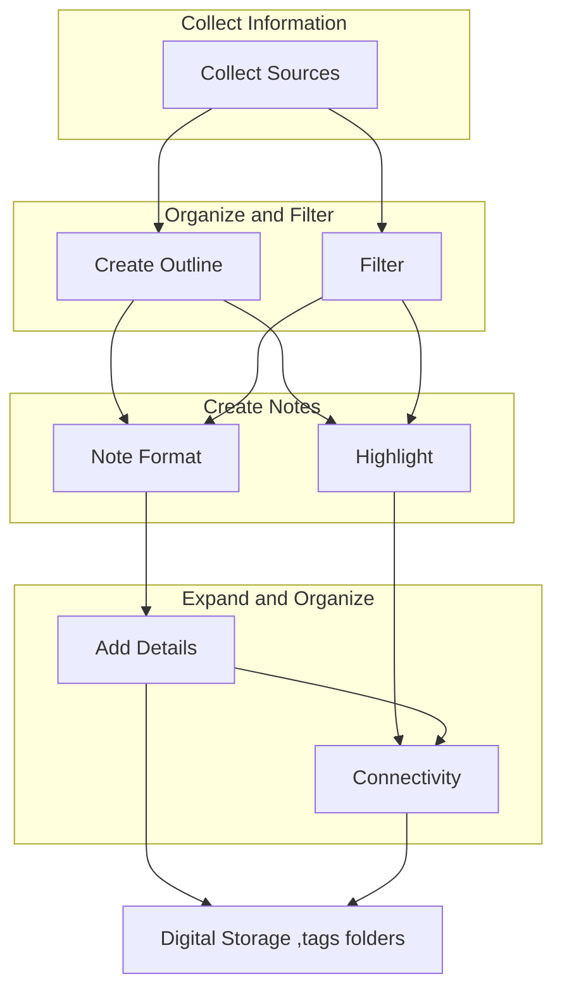
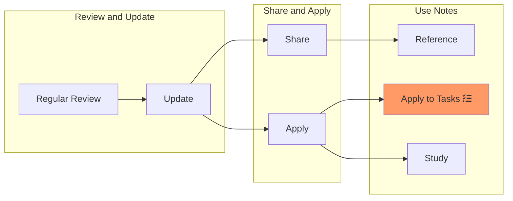
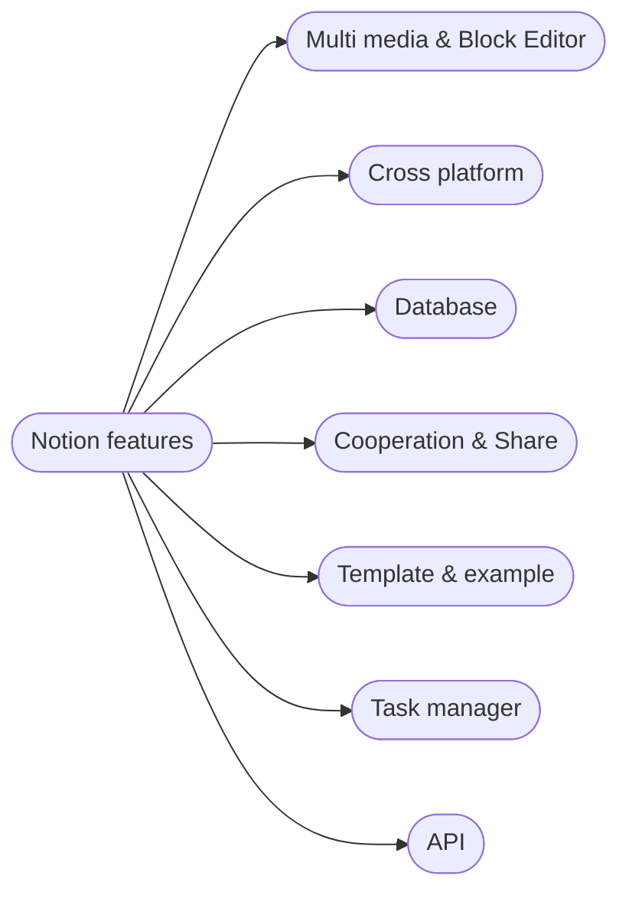

---
{"dg-publish":true,"permalink":"/publish/productivity-tools/"}
---


### What's productivity software.

> Word processors, spreadsheets, presentation tools, note-taking apps, task managers, email clients, calendar/schedulers, cloud storage, and more. 

- Focus on note-taking app,  some productivity tips, graphical thinking and so on

--- 
<style> .container {font-family: sans-serif; text-align: center;} .button-wrapper button {z-index: 1;height: 40px; width: 100px; margin: 10px;padding: 5px;} .excalidraw .App-menu_top .buttonList { display: flex;} .excalidraw-wrapper { height: 800px; margin: 50px; position: relative;} :root[dir="ltr"] .excalidraw .layer-ui__wrapper .zen-mode-transition.App-menu_bottom--transition-left {transform: none;} </style><script src="https://cdn.jsdelivr.net/npm/react@17/umd/react.production.min.js"></script><script src="https://cdn.jsdelivr.net/npm/react-dom@17/umd/react-dom.production.min.js"></script><script type="text/javascript" src="https://cdn.jsdelivr.net/npm/@excalidraw/excalidraw@0/dist/excalidraw.production.min.js"></script><div id="notetool_timelineexcalidraw.md1"></div><script>(function(){const InitialData={"type":"excalidraw","version":2,"source":"https://excalidraw.com","elements":[{"type":"ellipse","version":336,"versionNonce":1436521008,"isDeleted":false,"id":"2Rd5ZwJMWpTTib8HtG4MS","fillStyle":"hachure","strokeWidth":0.5,"strokeStyle":"solid","roughness":1,"opacity":100,"angle":0,"x":265.9139940205379,"y":140.94215697143102,"strokeColor":"#343a40","backgroundColor":"#f322","width":142.41228070175438,"height":138.13283208020044,"seed":249295605,"groupIds":[],"strokeSharpness":"round","boundElements":[],"updated":1692091188048,"link":null,"locked":false},{"type":"arrow","version":491,"versionNonce":464093392,"isDeleted":false,"id":"AE3y79tP-pOJ4piL-KKmc","fillStyle":"hachure","strokeWidth":1,"strokeStyle":"solid","roughness":1,"opacity":100,"angle":0,"x":-225.9800212331417,"y":9.167875949348069,"strokeColor":"#000000","backgroundColor":"transparent","width":714.5493629308967,"height":1.665783750856523,"seed":497085019,"groupIds":[],"strokeSharpness":"round","boundElements":[],"updated":1692091174211,"link":null,"locked":false,"startBinding":null,"endBinding":null,"lastCommittedPoint":null,"startArrowhead":null,"endArrowhead":"arrow","points":[[0,0],[714.5493629308967,-1.665783750856523]]},{"type":"ellipse","version":257,"versionNonce":1850192944,"isDeleted":false,"id":"IZ7PpHj9ZWDVif_r8lvy6","fillStyle":"solid","strokeWidth":0.5,"strokeStyle":"solid","roughness":0,"opacity":100,"angle":0,"x":-189.56753234287726,"y":0.17240116100680325,"strokeColor":"#000000","backgroundColor":"#a5d8ff","width":14.504394531250005,"height":15.356445312499996,"seed":163168629,"groupIds":["sa3lfGGZPMOnQEO1Da3Al"],"strokeSharpness":"sharp","boundElements":[],"updated":1692091174211,"link":null,"locked":false},{"type":"line","version":167,"versionNonce":1113646800,"isDeleted":false,"id":"UqkBkGtYFGvHxPu5BnfT5","fillStyle":"hachure","strokeWidth":0.5,"strokeStyle":"dotted","roughness":0,"opacity":100,"angle":0,"x":-182.96352843662726,"y":15.819373817256803,"strokeColor":"#000000","backgroundColor":"#a5d8ff","width":1.35009765625,"height":244.521484375,"seed":2016367579,"groupIds":["sa3lfGGZPMOnQEO1Da3Al"],"strokeSharpness":"round","boundElements":[],"updated":1692091174211,"link":null,"locked":false,"startBinding":null,"endBinding":null,"lastCommittedPoint":null,"startArrowhead":null,"endArrowhead":null,"points":[[0,0],[-1.35009765625,244.521484375]]},{"type":"text","version":101,"versionNonce":1034006064,"isDeleted":false,"id":"3VwC2KpU","fillStyle":"hachure","strokeWidth":0.5,"strokeStyle":"dotted","roughness":0,"opacity":100,"angle":0,"x":-201.94790343662726,"y":-23.786094932743197,"strokeColor":"#000000","backgroundColor":"#a5d8ff","width":46,"height":20,"seed":390785109,"groupIds":["sa3lfGGZPMOnQEO1Da3Al"],"strokeSharpness":"sharp","boundElements":[{"id":"AE3y79tP-pOJ4piL-KKmc","type":"arrow"}],"updated":1692091174211,"link":null,"locked":false,"fontSize":16,"fontFamily":1,"text":"1990s","rawText":"1990s","baseline":14,"textAlign":"left","verticalAlign":"top","containerId":null,"originalText":"1990s"},{"type":"rectangle","version":229,"versionNonce":691768528,"isDeleted":false,"id":"G8UEN4n0TVK8Faj8f2q8F","fillStyle":"solid","strokeWidth":0.5,"strokeStyle":"solid","roughness":1,"opacity":100,"angle":0,"x":-256.48110656162726,"y":27.673621864131803,"strokeColor":"#000000","backgroundColor":"#b2f2bb","width":152,"height":30,"seed":1506297621,"groupIds":[],"strokeSharpness":"round","boundElements":[{"type":"text","id":"1qODsxFm"}],"updated":1692091174211,"link":null,"locked":false},{"type":"text","version":38,"versionNonce":1135372336,"isDeleted":false,"id":"1qODsxFm","fillStyle":"solid","strokeWidth":0.5,"strokeStyle":"dotted","roughness":1,"opacity":100,"angle":0,"x":-248.48110656162726,"y":32.6736218641318,"strokeColor":"#000000","backgroundColor":"#ffff","width":136,"height":20,"seed":1314249813,"groupIds":[],"strokeSharpness":"round","boundElements":[],"updated":1692091174211,"link":null,"locked":false,"fontSize":16,"fontFamily":1,"text":"basic note-taking","rawText":"basic note-taking","baseline":14,"textAlign":"center","verticalAlign":"middle","containerId":"G8UEN4n0TVK8Faj8f2q8F","originalText":"basic note-taking"},{"type":"ellipse","version":336,"versionNonce":1775334096,"isDeleted":false,"id":"SVzOHrLNDV3wLoPEqopCL","fillStyle":"solid","strokeWidth":0.5,"strokeStyle":"solid","roughness":0,"opacity":100,"angle":0,"x":-30.797861583948702,"y":1.1982800672568032,"strokeColor":"#000000","backgroundColor":"#a5d8ff","width":14.504394531250005,"height":15.356445312499996,"seed":1224253787,"groupIds":["BAgVGeM8UfsXbMps-2xKB"],"strokeSharpness":"sharp","boundElements":[],"updated":1692091174211,"link":null,"locked":false},{"type":"line","version":246,"versionNonce":1817174576,"isDeleted":false,"id":"fvNY0uJ4lQEoG1zmnSevw","fillStyle":"hachure","strokeWidth":0.5,"strokeStyle":"dotted","roughness":0,"opacity":100,"angle":0,"x":-24.193857677698702,"y":16.845252723506803,"strokeColor":"#000000","backgroundColor":"#a5d8ff","width":1.35009765625,"height":244.521484375,"seed":1499526613,"groupIds":["BAgVGeM8UfsXbMps-2xKB"],"strokeSharpness":"round","boundElements":[],"updated":1692091174211,"link":null,"locked":false,"startBinding":null,"endBinding":null,"lastCommittedPoint":null,"startArrowhead":null,"endArrowhead":null,"points":[[0,0],[-1.35009765625,244.521484375]]},{"type":"text","version":189,"versionNonce":716871888,"isDeleted":false,"id":"rk8lLn1U","fillStyle":"hachure","strokeWidth":0.5,"strokeStyle":"dotted","roughness":0,"opacity":100,"angle":0,"x":-43.1782326776987,"y":-22.760216026493197,"strokeColor":"#000000","backgroundColor":"#a5d8ff","width":55,"height":20,"seed":565296635,"groupIds":["BAgVGeM8UfsXbMps-2xKB"],"strokeSharpness":"sharp","boundElements":[],"updated":1692091174211,"link":null,"locked":false,"fontSize":16,"fontFamily":1,"text":"2000s","rawText":"2000s","baseline":14,"textAlign":"left","verticalAlign":"top","containerId":null,"originalText":"2000s"},{"type":"rectangle","version":429,"versionNonce":1718885424,"isDeleted":false,"id":"qrg--tTZmz8xuYHHTIgC6","fillStyle":"solid","strokeWidth":0.5,"strokeStyle":"solid","roughness":1,"opacity":100,"angle":0,"x":-88.31655578037726,"y":23.963905067256803,"strokeColor":"#000000","backgroundColor":"#b2f2bb","width":194,"height":32,"seed":1666185301,"groupIds":[],"strokeSharpness":"round","boundElements":[{"id":"wIS0exM8","type":"text"}],"updated":1692091174211,"link":null,"locked":false},{"type":"text","version":143,"versionNonce":2140077776,"isDeleted":false,"id":"wIS0exM8","fillStyle":"solid","strokeWidth":0.5,"strokeStyle":"dotted","roughness":1,"opacity":100,"angle":0,"x":-79.81655578037726,"y":29.963905067256803,"strokeColor":"#000000","backgroundColor":"#ffff","width":177,"height":20,"seed":873079675,"groupIds":[],"strokeSharpness":"round","boundElements":[],"updated":1692091174212,"link":null,"locked":false,"fontSize":16,"fontFamily":1,"text":"Dedicated note-taking","rawText":"Dedicated note-taking","baseline":14,"textAlign":"center","verticalAlign":"middle","containerId":"qrg--tTZmz8xuYHHTIgC6","originalText":"Dedicated note-taking"},{"type":"text","version":12,"versionNonce":1140921904,"isDeleted":false,"id":"gQBBgjVX","fillStyle":"solid","strokeWidth":0.5,"strokeStyle":"solid","roughness":1,"opacity":100,"angle":0,"x":-174.03286437412726,"y":78.9609753797568,"strokeColor":"#000000","backgroundColor":"#b2f2bb","width":67,"height":20,"seed":1954087989,"groupIds":[],"strokeSharpness":"round","boundElements":[],"updated":1692091174212,"link":null,"locked":false,"fontSize":16,"fontFamily":1,"text":"Notepad","rawText":"Notepad","baseline":14,"textAlign":"left","verticalAlign":"top","containerId":null,"originalText":"Notepad"},{"type":"text","version":18,"versionNonce":1223075024,"isDeleted":false,"id":"j4SMdO7l","fillStyle":"solid","strokeWidth":0.5,"strokeStyle":"solid","roughness":1,"opacity":100,"angle":0,"x":-176.42446593662726,"y":115.5337292860068,"strokeColor":"#000000","backgroundColor":"#b2f2bb","width":49,"height":20,"seed":1676067285,"groupIds":[],"strokeSharpness":"round","boundElements":[],"updated":1692091174212,"link":null,"locked":false,"fontSize":16,"fontFamily":1,"text":"Office","rawText":"Office","baseline":14,"textAlign":"left","verticalAlign":"top","containerId":null,"originalText":"Office"},{"type":"text","version":56,"versionNonce":434032688,"isDeleted":false,"id":"nUpmlphM","fillStyle":"solid","strokeWidth":0.5,"strokeStyle":"solid","roughness":1,"opacity":100,"angle":0,"x":-18.895169061627257,"y":80.9951550672568,"strokeColor":"#000000","backgroundColor":"#b2f2bb","width":116,"height":20,"seed":761271157,"groupIds":[],"strokeSharpness":"round","boundElements":[],"updated":1692091174212,"link":null,"locked":false,"fontSize":16,"fontFamily":1,"text":"Onenote 2003","rawText":"Onenote 2003","baseline":14,"textAlign":"left","verticalAlign":"top","containerId":null,"originalText":"Onenote 2003"},{"type":"text","version":102,"versionNonce":341412560,"isDeleted":false,"id":"mGE7Fcqv","fillStyle":"solid","strokeWidth":0.5,"strokeStyle":"solid","roughness":1,"opacity":100,"angle":0,"x":-15.548489374127257,"y":112.8091199110068,"strokeColor":"#f08c00","backgroundColor":"#b2f2bb","width":125,"height":20,"seed":862531029,"groupIds":[],"strokeSharpness":"round","boundElements":[],"updated":1692091174212,"link":null,"locked":false,"fontSize":16,"fontFamily":1,"text":"Evernote 2008","rawText":"Evernote 2008","baseline":14,"textAlign":"left","verticalAlign":"top","containerId":null,"originalText":"Evernote 2008"},{"type":"text","version":116,"versionNonce":536169008,"isDeleted":false,"id":"n6ASc4n5","fillStyle":"solid","strokeWidth":0.5,"strokeStyle":"solid","roughness":1,"opacity":100,"angle":0,"x":-17.235989374127257,"y":142.9653699110068,"strokeColor":"#000000","backgroundColor":"#b2f2bb","width":132,"height":20,"seed":854112187,"groupIds":[],"strokeSharpness":"round","boundElements":[],"updated":1692091174212,"link":null,"locked":false,"fontSize":16,"fontFamily":1,"text":"Simplenote 2005","rawText":"Simplenote 2005","baseline":14,"textAlign":"left","verticalAlign":"top","containerId":null,"originalText":"Simplenote 2005"},{"type":"ellipse","version":419,"versionNonce":2088743120,"isDeleted":false,"id":"T8FMV9qEe3fomLAvhkk9w","fillStyle":"solid","strokeWidth":0.5,"strokeStyle":"solid","roughness":0,"opacity":100,"angle":0,"x":201.37973328212274,"y":-3.0082629014931968,"strokeColor":"#000000","backgroundColor":"#a5d8ff","width":14.504394531250005,"height":15.356445312499996,"seed":1708344213,"groupIds":["rCepMRRqMx3aVksDUGBQU"],"strokeSharpness":"sharp","boundElements":[],"updated":1692091174212,"link":null,"locked":false},{"type":"line","version":329,"versionNonce":1361871920,"isDeleted":false,"id":"bU7JqSkL79SQ7huQ9sVvg","fillStyle":"hachure","strokeWidth":0.5,"strokeStyle":"dotted","roughness":0,"opacity":100,"angle":0,"x":207.98373718837274,"y":12.638709754756803,"strokeColor":"#000000","backgroundColor":"#a5d8ff","width":1.35009765625,"height":244.521484375,"seed":111422523,"groupIds":["rCepMRRqMx3aVksDUGBQU"],"strokeSharpness":"round","boundElements":[],"updated":1692091174212,"link":null,"locked":false,"startBinding":null,"endBinding":null,"lastCommittedPoint":null,"startArrowhead":null,"endArrowhead":null,"points":[[0,0],[-1.35009765625,244.521484375]]},{"type":"text","version":274,"versionNonce":150017744,"isDeleted":false,"id":"jlHZxrng","fillStyle":"hachure","strokeWidth":0.5,"strokeStyle":"dotted","roughness":0,"opacity":100,"angle":0,"x":188.99692078212274,"y":-26.966758995243197,"strokeColor":"#000000","backgroundColor":"#a5d8ff","width":48,"height":20,"seed":1177553141,"groupIds":["rCepMRRqMx3aVksDUGBQU"],"strokeSharpness":"sharp","boundElements":[],"updated":1692091174212,"link":null,"locked":false,"fontSize":16,"fontFamily":1,"text":"2010s","rawText":"2010s","baseline":14,"textAlign":"left","verticalAlign":"top","containerId":null,"originalText":"2010s"},{"type":"rectangle","version":487,"versionNonce":191659568,"isDeleted":false,"id":"8LbO3Ns3iIf1IHsFjKIo9","fillStyle":"solid","strokeWidth":0.5,"strokeStyle":"solid","roughness":1,"opacity":100,"angle":0,"x":111.08383484462274,"y":22.915076942256803,"strokeColor":"#000000","backgroundColor":"#b2f2bb","width":194,"height":32,"seed":439187515,"groupIds":[],"strokeSharpness":"round","boundElements":[{"id":"TGgka7j8","type":"text"}],"updated":1692091174212,"link":null,"locked":false},{"type":"text","version":236,"versionNonce":239451344,"isDeleted":false,"id":"TGgka7j8","fillStyle":"solid","strokeWidth":0.5,"strokeStyle":"dotted","roughness":1,"opacity":100,"angle":0,"x":147.58383484462274,"y":28.915076942256803,"strokeColor":"#000000","backgroundColor":"#ffff","width":121,"height":20,"seed":61963509,"groupIds":[],"strokeSharpness":"round","boundElements":[],"updated":1692091174212,"link":null,"locked":false,"fontSize":16,"fontFamily":1,"text":"Mobile adoption","rawText":"Mobile adoption","baseline":14,"textAlign":"center","verticalAlign":"middle","containerId":"8LbO3Ns3iIf1IHsFjKIo9","originalText":"Mobile adoption"},{"type":"ellipse","version":479,"versionNonce":798832688,"isDeleted":false,"id":"NeGvZY41F11wNEh2S2PLY","fillStyle":"solid","strokeWidth":0.5,"strokeStyle":"solid","roughness":0,"opacity":100,"angle":0,"x":424.97006531337274,"y":-2.5566027452431968,"strokeColor":"#000000","backgroundColor":"#a5d8ff","width":14.504394531250005,"height":15.356445312499996,"seed":760461179,"groupIds":["ihAbNpqHqakr-rqgOCy1w"],"strokeSharpness":"sharp","boundElements":[],"updated":1692091174212,"link":null,"locked":false},{"type":"line","version":389,"versionNonce":236298960,"isDeleted":false,"id":"CJLbi0_Mm5MzJLYd3aFlk","fillStyle":"hachure","strokeWidth":0.5,"strokeStyle":"dotted","roughness":0,"opacity":100,"angle":0,"x":431.57406921962274,"y":13.090369911006803,"strokeColor":"#000000","backgroundColor":"#a5d8ff","width":1.35009765625,"height":244.521484375,"seed":1283576245,"groupIds":["ihAbNpqHqakr-rqgOCy1w"],"strokeSharpness":"round","boundElements":[],"updated":1692091174212,"link":null,"locked":false,"startBinding":null,"endBinding":null,"lastCommittedPoint":null,"startArrowhead":null,"endArrowhead":null,"points":[[0,0],[-1.35009765625,244.521484375]]},{"type":"text","version":340,"versionNonce":1101443632,"isDeleted":false,"id":"cvb2oq88","fillStyle":"hachure","strokeWidth":0.5,"strokeStyle":"dotted","roughness":0,"opacity":100,"angle":0,"x":412.51889343837274,"y":-26.451622276493197,"strokeColor":"#000000","backgroundColor":"#a5d8ff","width":31,"height":20,"seed":310710299,"groupIds":["ihAbNpqHqakr-rqgOCy1w"],"strokeSharpness":"sharp","boundElements":[],"updated":1692091174212,"link":null,"locked":false,"fontSize":16,"fontFamily":1,"text":"Now","rawText":"Now","baseline":14,"textAlign":"left","verticalAlign":"top","containerId":null,"originalText":"Now"},{"type":"rectangle","version":550,"versionNonce":385403088,"isDeleted":false,"id":"TsRgLwXzvWaiq4IuhoDdK","fillStyle":"solid","strokeWidth":0.5,"strokeStyle":"solid","roughness":1,"opacity":100,"angle":0,"x":338.77914734462274,"y":22.219276161006803,"strokeColor":"#000000","backgroundColor":"#b2f2bb","width":122,"height":30,"seed":148918459,"groupIds":[],"strokeSharpness":"round","boundElements":[{"id":"eyvCaw3S","type":"text"}],"updated":1692091174212,"link":null,"locked":false},{"type":"text","version":304,"versionNonce":141618224,"isDeleted":false,"id":"eyvCaw3S","fillStyle":"solid","strokeWidth":0.5,"strokeStyle":"dotted","roughness":1,"opacity":100,"angle":0,"x":389.27914734462274,"y":27.219276161006803,"strokeColor":"#000000","backgroundColor":"#ffff","width":21,"height":20,"seed":815164533,"groupIds":[],"strokeSharpness":"round","boundElements":[],"updated":1692091174212,"link":null,"locked":false,"fontSize":16,"fontFamily":1,"text":"AI","rawText":"AI","baseline":14,"textAlign":"center","verticalAlign":"middle","containerId":"TsRgLwXzvWaiq4IuhoDdK","originalText":"AI"},{"type":"rectangle","version":525,"versionNonce":612839120,"isDeleted":false,"id":"iA2VpVa-LVpLTG1H9tVYt","fillStyle":"solid","strokeWidth":0.5,"strokeStyle":"solid","roughness":1,"opacity":100,"angle":0,"x":223.4150290410513,"y":63.4668347547568,"strokeColor":"#000000","backgroundColor":"#b2f2bb","width":194,"height":32,"seed":1755127323,"groupIds":[],"strokeSharpness":"round","boundElements":[{"id":"lm8LrqXP","type":"text"}],"updated":1692091174212,"link":null,"locked":false},{"type":"text","version":281,"versionNonce":769910320,"isDeleted":false,"id":"lm8LrqXP","fillStyle":"solid","strokeWidth":0.5,"strokeStyle":"dotted","roughness":1,"opacity":100,"angle":0,"x":298.9150290410513,"y":69.4668347547568,"strokeColor":"#000000","backgroundColor":"#ffff","width":43,"height":20,"seed":1373611285,"groupIds":[],"strokeSharpness":"round","boundElements":[],"updated":1692091174212,"link":null,"locked":false,"fontSize":16,"fontFamily":1,"text":"SaaS","rawText":"SaaS","baseline":14,"textAlign":"center","verticalAlign":"middle","containerId":"iA2VpVa-LVpLTG1H9tVYt","originalText":"SaaS"},{"type":"text","version":235,"versionNonce":2136528080,"isDeleted":false,"id":"UCOLnBPP","fillStyle":"solid","strokeWidth":0.5,"strokeStyle":"solid","roughness":1,"opacity":100,"angle":0,"x":228.65121765712274,"y":116.3052136610068,"strokeColor":"#000000","backgroundColor":"#b2f2bb","width":67,"height":30,"seed":443146933,"groupIds":[],"strokeSharpness":"round","boundElements":[],"updated":1692091174212,"link":null,"locked":false,"fontSize":12.0371296968353,"fontFamily":1,"text":"google keep\n","rawText":"google keep\n","baseline":26,"textAlign":"left","verticalAlign":"top","containerId":null,"originalText":"google keep\n"},{"type":"text","version":287,"versionNonce":1592238128,"isDeleted":false,"id":"MVU5e82A","fillStyle":"solid","strokeWidth":0.5,"strokeStyle":"solid","roughness":1,"opacity":100,"angle":0,"x":227.15976257899774,"y":151.3625867078818,"strokeColor":"#000000","backgroundColor":"#b2f2bb","width":58,"height":15,"seed":751433141,"groupIds":[],"strokeSharpness":"round","boundElements":[],"updated":1692091174212,"link":null,"locked":false,"fontSize":12.0371296968353,"fontFamily":1,"text":"Notability","rawText":"Notability","baseline":11,"textAlign":"left","verticalAlign":"top","containerId":null,"originalText":"Notability"},{"type":"text","version":314,"versionNonce":486914768,"isDeleted":false,"id":"L02FBBqQ","fillStyle":"solid","strokeWidth":0.5,"strokeStyle":"solid","roughness":1,"opacity":100,"angle":0,"x":228.11703796962274,"y":184.6548230360068,"strokeColor":"#000000","backgroundColor":"#b2f2bb","width":28,"height":15,"seed":1162722011,"groupIds":[],"strokeSharpness":"round","boundElements":[],"updated":1692091174213,"link":null,"locked":false,"fontSize":12.0371296968353,"fontFamily":1,"text":"bear","rawText":"bear","baseline":11,"textAlign":"left","verticalAlign":"top","containerId":null,"originalText":"bear"},{"type":"text","version":198,"versionNonce":1801722416,"isDeleted":false,"id":"nT5yeZLY","fillStyle":"solid","strokeWidth":0.5,"strokeStyle":"solid","roughness":1,"opacity":100,"angle":0,"x":360.6767245395632,"y":186.08804476219728,"strokeColor":"#f08c00","backgroundColor":"#b2f2bb","width":50,"height":20,"seed":1621873019,"groupIds":[],"strokeSharpness":"round","boundElements":[],"updated":1692091174213,"link":null,"locked":false,"fontSize":16,"fontFamily":1,"text":"Notion","rawText":"Notion","baseline":14,"textAlign":"left","verticalAlign":"top","containerId":null,"originalText":"Notion"},{"type":"text","version":405,"versionNonce":2482384,"isDeleted":false,"id":"CvcGsNJR","fillStyle":"solid","strokeWidth":0.5,"strokeStyle":"solid","roughness":1,"opacity":100,"angle":0,"x":357.3475616776856,"y":111.97412726693216,"strokeColor":"#000000","backgroundColor":"#b2f2bb","width":49,"height":15,"seed":1017985339,"groupIds":[],"strokeSharpness":"round","boundElements":[],"updated":1692091174213,"link":null,"locked":false,"fontSize":12.0371296968353,"fontFamily":1,"text":"Obsidian","rawText":"Obsidian","baseline":11,"textAlign":"left","verticalAlign":"top","containerId":null,"originalText":"Obsidian"},{"type":"rectangle","version":478,"versionNonce":1715557424,"isDeleted":false,"id":"KOaKXRSrlv5DHsNoLeD8A","fillStyle":"hachure","strokeWidth":0.5,"strokeStyle":"solid","roughness":1,"opacity":100,"angle":0,"x":272.427543519285,"y":266.3592152421079,"strokeColor":"#343a40","backgroundColor":"#f322","width":121,"height":30,"seed":1083801179,"groupIds":[],"strokeSharpness":"round","boundElements":[{"type":"text","id":"Q54pqLuI"}],"updated":1692091174213,"link":null,"locked":false},{"type":"text","version":351,"versionNonce":407979728,"isDeleted":false,"id":"Q54pqLuI","fillStyle":"hachure","strokeWidth":0.5,"strokeStyle":"solid","roughness":1,"opacity":100,"angle":0,"x":292.427543519285,"y":271.3592152421079,"strokeColor":"#343a40","backgroundColor":"#f322","width":81,"height":20,"seed":1395141269,"groupIds":[],"strokeSharpness":"round","boundElements":[],"updated":1692091174213,"link":null,"locked":false,"fontSize":16,"fontFamily":1,"text":"All In One","rawText":"All In One","baseline":14,"textAlign":"center","verticalAlign":"middle","containerId":"KOaKXRSrlv5DHsNoLeD8A","originalText":"All In One"},{"type":"text","version":128,"versionNonce":1164398128,"isDeleted":false,"id":"RmHwUeoQ","fillStyle":"hachure","strokeWidth":0.5,"strokeStyle":"solid","roughness":1,"opacity":100,"angle":0,"x":299.1129804781592,"y":181.0099863460041,"strokeColor":"#343a40","backgroundColor":"#f322","width":41,"height":20,"seed":345678421,"groupIds":[],"strokeSharpness":"round","boundElements":[],"updated":1692091174213,"link":null,"locked":false,"fontSize":16,"fontFamily":1,"text":"slack","rawText":"slack","baseline":14,"textAlign":"left","verticalAlign":"top","containerId":null,"originalText":"slack"},{"type":"text","version":214,"versionNonce":572517584,"isDeleted":false,"id":"r8yXMJ2B","fillStyle":"hachure","strokeWidth":0.5,"strokeStyle":"solid","roughness":1,"opacity":100,"angle":0,"x":297.0391506621419,"y":205.94626881353668,"strokeColor":"#343a40","backgroundColor":"#f322","width":59,"height":40,"seed":796309147,"groupIds":[],"strokeSharpness":"round","boundElements":[],"updated":1692091174213,"link":null,"locked":false,"fontSize":16,"fontFamily":1,"text":"dingtqlk\n","rawText":"dingtqlk\n","baseline":34,"textAlign":"left","verticalAlign":"top","containerId":null,"originalText":"dingtqlk\n"},{"type":"text","version":231,"versionNonce":29231152,"isDeleted":false,"id":"8Qm9kJoA","fillStyle":"hachure","strokeWidth":0.5,"strokeStyle":"solid","roughness":1,"opacity":100,"angle":0,"x":288.49673994785616,"y":232.29671524210795,"strokeColor":"#343a40","backgroundColor":"#f322","width":86,"height":20,"seed":1084238971,"groupIds":[],"strokeSharpness":"round","boundElements":[],"updated":1692091174213,"link":null,"locked":false,"fontSize":16,"fontFamily":1,"text":"office 365","rawText":"office 365","baseline":14,"textAlign":"left","verticalAlign":"top","containerId":null,"originalText":"office 365"},{"type":"text","version":43,"versionNonce":120181456,"isDeleted":false,"id":"MtOXt1kz","fillStyle":"hachure","strokeWidth":0.5,"strokeStyle":"solid","roughness":1,"opacity":100,"angle":0,"x":-175.7983477802257,"y":-65.00367996480273,"strokeColor":"#343a40","backgroundColor":"#f322","width":56,"height":20,"seed":38264247,"groupIds":[],"strokeSharpness":"round","boundElements":[],"updated":1692091174213,"link":null,"locked":false,"fontSize":16,"fontFamily":1,"text":"web 1.0","rawText":"web 1.0","baseline":14,"textAlign":"left","verticalAlign":"top","containerId":null,"originalText":"web 1.0"},{"type":"text","version":123,"versionNonce":925729328,"isDeleted":false,"id":"luJhotGb","fillStyle":"hachure","strokeWidth":0.5,"strokeStyle":"solid","roughness":1,"opacity":100,"angle":0,"x":-8.161858809637607,"y":-66.69853290597919,"strokeColor":"#343a40","backgroundColor":"#f322","width":63,"height":20,"seed":1200073849,"groupIds":[],"strokeSharpness":"round","boundElements":[],"updated":1692091174213,"link":null,"locked":false,"fontSize":16,"fontFamily":1,"text":"web 2.0","rawText":"web 2.0","baseline":14,"textAlign":"left","verticalAlign":"top","containerId":null,"originalText":"web 2.0"},{"type":"text","version":189,"versionNonce":1040644304,"isDeleted":false,"id":"rr4NfFCC","fillStyle":"hachure","strokeWidth":0.5,"strokeStyle":"solid","roughness":1,"opacity":100,"angle":0,"x":65.1602919256564,"y":-40.74954393539099,"strokeColor":"#343a40","backgroundColor":"#f322","width":58,"height":20,"seed":615044823,"groupIds":[],"strokeSharpness":"round","boundElements":[],"updated":1692091174213,"link":null,"locked":false,"fontSize":16,"fontFamily":1,"text":"Blogger","rawText":"Blogger","baseline":14,"textAlign":"left","verticalAlign":"top","containerId":null,"originalText":"Blogger"},{"type":"text","version":167,"versionNonce":1151188016,"isDeleted":false,"id":"vRazUJPJ","fillStyle":"hachure","strokeWidth":0.5,"strokeStyle":"solid","roughness":1,"opacity":100,"angle":0,"x":400.0706779550683,"y":-62.91406599421444,"strokeColor":"#343a40","backgroundColor":"#f322","width":63,"height":20,"seed":877555095,"groupIds":[],"strokeSharpness":"round","boundElements":[],"updated":1692091174213,"link":null,"locked":false,"fontSize":16,"fontFamily":1,"text":"web 3.0","rawText":"web 3.0","baseline":14,"textAlign":"left","verticalAlign":"top","containerId":null,"originalText":"web 3.0"},{"type":"line","version":42,"versionNonce":709844688,"isDeleted":false,"id":"8CsFFTvQTyaKe6hVSp7hM","fillStyle":"hachure","strokeWidth":0.5,"strokeStyle":"solid","roughness":1,"opacity":100,"angle":0,"x":396.4925529550683,"y":-52.13281599421444,"strokeColor":"#343a40","backgroundColor":"#f322","width":75.49402573529414,"height":0.912224264705884,"seed":972467513,"groupIds":[],"strokeSharpness":"round","boundElements":[],"updated":1692091174213,"link":null,"locked":false,"startBinding":null,"endBinding":null,"lastCommittedPoint":null,"startArrowhead":null,"endArrowhead":null,"points":[[0,0],[75.49402573529414,-0.912224264705884]]},{"id":"nEbUBIl6","type":"text","x":328.646190725966,"y":157.2752424838538,"width":39,"height":20,"angle":0,"strokeColor":"#343a40","backgroundColor":"#f322","fillStyle":"hachure","strokeWidth":0.5,"strokeStyle":"solid","roughness":1,"opacity":100,"groupIds":[],"strokeSharpness":"round","seed":58583248,"version":8,"versionNonce":1273821744,"isDeleted":false,"boundElements":null,"updated":1692091191841,"link":null,"locked":false,"text":"zoom","rawText":"zoom","fontSize":16,"fontFamily":1,"textAlign":"left","verticalAlign":"top","baseline":14,"containerId":null,"originalText":"zoom"}],"appState":{"theme":"light","viewBackgroundColor":"#ffffff","currentItemStrokeColor":"#343a40","currentItemBackgroundColor":"#f322","currentItemFillStyle":"hachure","currentItemStrokeWidth":0.5,"currentItemStrokeStyle":"solid","currentItemRoughness":1,"currentItemOpacity":100,"currentItemFontFamily":1,"currentItemFontSize":16,"currentItemTextAlign":"left","currentItemStrokeSharpness":"round","currentItemStartArrowhead":null,"currentItemEndArrowhead":"arrow","currentItemLinearStrokeSharpness":"round","gridSize":null,"colorPalette":{}},"files":{}};InitialData.scrollToContent=true;App=()=>{const e=React.useRef(null),t=React.useRef(null),[n,i]=React.useState({width:void 0,height:void 0});return React.useEffect(()=>{i({width:t.current.getBoundingClientRect().width,height:t.current.getBoundingClientRect().height});const e=()=>{i({width:t.current.getBoundingClientRect().width,height:t.current.getBoundingClientRect().height})};return window.addEventListener("resize",e),()=>window.removeEventListener("resize",e)},[t]),React.createElement(React.Fragment,null,React.createElement("div",{className:"excalidraw-wrapper",ref:t},React.createElement(ExcalidrawLib.Excalidraw,{ref:e,width:n.width,height:n.height,initialData:InitialData,viewModeEnabled:!0,zenModeEnabled:!0,gridModeEnabled:!1})))},excalidrawWrapper=document.getElementById("notetool_timelineexcalidraw.md1");ReactDOM.render(React.createElement(App),excalidrawWrapper);})();</script>


---
Flow data collection and storage


---

Workflow data management & use


---
### What is GTD


---

<div id="GTD_simpleexcalidraw.md2"></div><script>(function(){const InitialData={"type":"excalidraw","version":2,"source":"https://excalidraw.com","elements":[{"type":"ellipse","version":99,"versionNonce":1431159355,"isDeleted":false,"id":"xgQawYgBN6YTXVaoIaeNe","fillStyle":"hachure","strokeWidth":1,"strokeStyle":"solid","roughness":1,"opacity":100,"angle":0,"x":-59.98046875,"y":-231.98046875,"strokeColor":"#000000","backgroundColor":"transparent","width":21.0234375,"height":29.6484375,"seed":2046626491,"groupIds":[],"strokeSharpness":"sharp","boundElements":[],"updated":1691984992659,"link":null,"locked":false},{"type":"ellipse","version":214,"versionNonce":1213563803,"isDeleted":false,"id":"Bqz8WERdVDo8OxbFzz6Hx","fillStyle":"hachure","strokeWidth":0.5,"strokeStyle":"solid","roughness":1,"opacity":100,"angle":0,"x":-238.64453125,"y":-12.61328125,"strokeColor":"#000000","backgroundColor":"#ced4da","width":271.56640625,"height":190.6796875,"seed":1322046229,"groupIds":[],"strokeSharpness":"sharp","boundElements":[{"id":"fj1Gdxze58puoSaEammgS","type":"arrow"},{"id":"PFOaBWwWjTJTJ6Lkxb6h4","type":"arrow"},{"id":"JOp1f35Q9hwwFntUYrHYc","type":"arrow"},{"id":"vtdN1qRgZhTMU6C023F1J","type":"arrow"}],"updated":1691985155527,"link":null,"locked":false},{"type":"text","version":81,"versionNonce":833690587,"isDeleted":false,"id":"fxKt3Rdt","fillStyle":"hachure","strokeWidth":0.5,"strokeStyle":"solid","roughness":1,"opacity":100,"angle":0,"x":-190.28515625,"y":10.19140625,"strokeColor":"#000000","backgroundColor":"transparent","width":84,"height":50,"seed":972515483,"groupIds":[],"strokeSharpness":"sharp","boundElements":[],"updated":1691985003570,"link":null,"locked":false,"fontSize":20,"fontFamily":1,"text":"Organize\n","rawText":"Organize\n","baseline":43,"textAlign":"left","verticalAlign":"top","containerId":null,"originalText":"Organize\n"},{"type":"ellipse","version":124,"versionNonce":1382245205,"isDeleted":false,"id":"FLDBC2L95aRT94YWx3JUF","fillStyle":"hachure","strokeWidth":0.5,"strokeStyle":"solid","roughness":1,"opacity":100,"angle":0,"x":-214.193359375,"y":72.18359375,"strokeColor":"#000000","backgroundColor":"transparent","width":100,"height":75,"seed":346031477,"groupIds":[],"strokeSharpness":"sharp","boundElements":[{"type":"text","id":"tCEbF5fd"}],"updated":1691985003570,"link":null,"locked":false},{"type":"text","version":76,"versionNonce":41347195,"isDeleted":false,"id":"tCEbF5fd","fillStyle":"hachure","strokeWidth":0.5,"strokeStyle":"solid","roughness":1,"opacity":100,"angle":0,"x":-206.193359375,"y":99.68359375,"strokeColor":"#000000","backgroundColor":"transparent","width":84,"height":20,"seed":589027381,"groupIds":[],"strokeSharpness":"sharp","boundElements":[],"updated":1691985003570,"link":null,"locked":false,"fontSize":16,"fontFamily":1,"text":"categorize","rawText":"categorize","baseline":14,"textAlign":"center","verticalAlign":"middle","containerId":"FLDBC2L95aRT94YWx3JUF","originalText":"categorize"},{"type":"ellipse","version":151,"versionNonce":858140853,"isDeleted":false,"id":"66jaVIH7q8Ep5--oCPblI","fillStyle":"hachure","strokeWidth":0.5,"strokeStyle":"solid","roughness":1,"opacity":100,"angle":0,"x":-95.046875,"y":59.94921875,"strokeColor":"#000000","backgroundColor":"transparent","width":100,"height":75,"seed":1112188091,"groupIds":[],"strokeSharpness":"sharp","boundElements":[{"id":"cMY82Y5o","type":"text"}],"updated":1691985003570,"link":null,"locked":false},{"type":"text","version":108,"versionNonce":505028891,"isDeleted":false,"id":"cMY82Y5o","fillStyle":"hachure","strokeWidth":0.5,"strokeStyle":"solid","roughness":1,"opacity":100,"angle":0,"x":-69.046875,"y":87.44921875,"strokeColor":"#000000","backgroundColor":"transparent","width":48,"height":20,"seed":1487624309,"groupIds":[],"strokeSharpness":"sharp","boundElements":[],"updated":1691985003570,"link":null,"locked":false,"fontSize":16,"fontFamily":1,"text":"review","rawText":"review","baseline":14,"textAlign":"center","verticalAlign":"middle","containerId":"66jaVIH7q8Ep5--oCPblI","originalText":"review"},{"type":"arrow","version":83,"versionNonce":795463376,"isDeleted":false,"id":"fj1Gdxze58puoSaEammgS","fillStyle":"hachure","strokeWidth":0.5,"strokeStyle":"solid","roughness":1,"opacity":100,"angle":0,"x":-53.95966207350111,"y":-151.4712772931797,"strokeColor":"#000000","backgroundColor":"transparent","width":10.722992153217717,"height":137.1861663756265,"seed":504186299,"groupIds":[],"strokeSharpness":"round","boundElements":[],"updated":1692091247526,"link":null,"locked":false,"startBinding":{"elementId":"f1ikRMMNtdXameFc1nTh_","focus":0.2967789626310238,"gap":8.042568462040329},"endBinding":{"elementId":"Bqz8WERdVDo8OxbFzz6Hx","focus":0.224990257663656,"gap":5.424713265673972},"lastCommittedPoint":null,"startArrowhead":null,"endArrowhead":"arrow","points":[[0,0],[-10.722992153217717,137.1861663756265]]},{"type":"text","version":48,"versionNonce":2085503675,"isDeleted":false,"id":"vsjrb2Gz","fillStyle":"hachure","strokeWidth":0.5,"strokeStyle":"solid","roughness":1,"opacity":100,"angle":0,"x":54.859375,"y":-193.69921875,"strokeColor":"#000000","backgroundColor":"transparent","width":30,"height":40,"seed":1603844827,"groupIds":[],"strokeSharpness":"sharp","boundElements":[],"updated":1691985075664,"link":null,"locked":false,"fontSize":16,"fontFamily":1,"text":"New\n","rawText":"New\n","baseline":34,"textAlign":"left","verticalAlign":"top","containerId":null,"originalText":"New\n"},{"type":"ellipse","version":91,"versionNonce":221491733,"isDeleted":false,"id":"GP-4TYxx_Ps-tPbdx7_6Q","fillStyle":"hachure","strokeWidth":0.5,"strokeStyle":"solid","roughness":1,"opacity":100,"angle":0,"x":152.4921875,"y":-171.8359375,"strokeColor":"#000000","backgroundColor":"#ced4da","width":147,"height":97,"seed":1262000571,"groupIds":[],"strokeSharpness":"sharp","boundElements":[{"type":"text","id":"YiKAsllL"},{"id":"fx6W6dqqwvRJ6jzb8cjrB","type":"arrow"},{"id":"PFOaBWwWjTJTJ6Lkxb6h4","type":"arrow"}],"updated":1691985117110,"link":null,"locked":false},{"type":"text","version":63,"versionNonce":465974171,"isDeleted":false,"id":"YiKAsllL","fillStyle":"hachure","strokeWidth":0.5,"strokeStyle":"solid","roughness":1,"opacity":100,"angle":0,"x":199.4921875,"y":-133.3359375,"strokeColor":"#000000","backgroundColor":"#ced4da","width":53,"height":20,"seed":2110133339,"groupIds":[],"strokeSharpness":"sharp","boundElements":[],"updated":1691985090209,"link":null,"locked":false,"fontSize":16,"fontFamily":1,"text":"collect","rawText":"collect","baseline":14,"textAlign":"center","verticalAlign":"middle","containerId":"GP-4TYxx_Ps-tPbdx7_6Q","originalText":"collect"},{"type":"arrow","version":162,"versionNonce":1424454864,"isDeleted":false,"id":"fx6W6dqqwvRJ6jzb8cjrB","fillStyle":"hachure","strokeWidth":0.5,"strokeStyle":"solid","roughness":1,"opacity":100,"angle":0,"x":-21.84705613738204,"y":-169.96635675434766,"strokeColor":"#000000","backgroundColor":"#ced4da","width":170.00961677690952,"height":40.48938882268021,"seed":277623643,"groupIds":[],"strokeSharpness":"round","boundElements":[],"updated":1692091247526,"link":null,"locked":false,"startBinding":{"elementId":"f1ikRMMNtdXameFc1nTh_","focus":0.16056079490100678,"gap":13.119464750068008},"endBinding":{"elementId":"GP-4TYxx_Ps-tPbdx7_6Q","gap":4.850418417699217,"focus":-0.24038571410419937},"lastCommittedPoint":null,"startArrowhead":null,"endArrowhead":"arrow","points":[[0,0],[170.00961677690952,40.48938882268021]]},{"type":"text","version":9,"versionNonce":20888277,"isDeleted":false,"id":"SN92VAD6","fillStyle":"hachure","strokeWidth":0.5,"strokeStyle":"solid","roughness":1,"opacity":100,"angle":0,"x":-116.59765625,"y":-111.23828125,"strokeColor":"#000000","backgroundColor":"#ced4da","width":46,"height":20,"seed":653692245,"groupIds":[],"strokeSharpness":"sharp","boundElements":[],"updated":1691985108211,"link":null,"locked":false,"fontSize":16,"fontFamily":1,"text":"start","rawText":"start","baseline":14,"textAlign":"left","verticalAlign":"top","containerId":null,"originalText":"start"},{"type":"arrow","version":29,"versionNonce":1884097744,"isDeleted":false,"id":"PFOaBWwWjTJTJ6Lkxb6h4","fillStyle":"hachure","strokeWidth":0.5,"strokeStyle":"solid","roughness":1,"opacity":100,"angle":0,"x":197.2900332477982,"y":-75.91445854305388,"strokeColor":"#000000","backgroundColor":"#ced4da","width":217.60928258661025,"height":81.81968468439946,"seed":732600373,"groupIds":[],"strokeSharpness":"round","boundElements":[],"updated":1692091229214,"link":null,"locked":false,"startBinding":{"elementId":"GP-4TYxx_Ps-tPbdx7_6Q","gap":2.6926735118402902,"focus":-0.6561997029431674},"endBinding":{"elementId":"Bqz8WERdVDo8OxbFzz6Hx","gap":1,"focus":-0.4233617039033093},"lastCommittedPoint":null,"startArrowhead":null,"endArrowhead":"arrow","points":[[0,0],[-217.60928258661025,81.81968468439946]]},{"type":"ellipse","version":96,"versionNonce":247648571,"isDeleted":false,"id":"ZSS0fgvGTmcmKGrcljxhM","fillStyle":"hachure","strokeWidth":0.5,"strokeStyle":"solid","roughness":1,"opacity":100,"angle":0,"x":161.35546875,"y":122.61328125,"strokeColor":"#000000","backgroundColor":"#ced4da","width":170,"height":75,"seed":360968405,"groupIds":[],"strokeSharpness":"sharp","boundElements":[{"type":"text","id":"p6itIWMe"},{"id":"JOp1f35Q9hwwFntUYrHYc","type":"arrow"},{"id":"vtdN1qRgZhTMU6C023F1J","type":"arrow"}],"updated":1691985159100,"link":null,"locked":false},{"type":"text","version":73,"versionNonce":1350185973,"isDeleted":false,"id":"p6itIWMe","fillStyle":"hachure","strokeWidth":0.5,"strokeStyle":"solid","roughness":1,"opacity":100,"angle":0,"x":213.85546875,"y":150.11328125,"strokeColor":"#000000","backgroundColor":"#ced4da","width":65,"height":20,"seed":1161845307,"groupIds":[],"strokeSharpness":"sharp","boundElements":[],"updated":1691985159100,"link":null,"locked":false,"fontSize":16,"fontFamily":1,"text":"Execute","rawText":"Execute","baseline":14,"textAlign":"center","verticalAlign":"middle","containerId":"ZSS0fgvGTmcmKGrcljxhM","originalText":"Execute"},{"type":"arrow","version":136,"versionNonce":1387459280,"isDeleted":false,"id":"JOp1f35Q9hwwFntUYrHYc","fillStyle":"hachure","strokeWidth":0.5,"strokeStyle":"solid","roughness":1,"opacity":100,"angle":0,"x":10.220628352860203,"y":137.719728134651,"strokeColor":"#000000","backgroundColor":"#ced4da","width":142.62374213191492,"height":26.580339638651083,"seed":1000550229,"groupIds":[],"strokeSharpness":"round","boundElements":[],"updated":1692091229219,"link":null,"locked":false,"startBinding":{"elementId":"Bqz8WERdVDo8OxbFzz6Hx","gap":1.5597556972395523,"focus":0.34383517783793693},"endBinding":{"elementId":"ZSS0fgvGTmcmKGrcljxhM","gap":8.894213796891918,"focus":-0.5309476935077698},"lastCommittedPoint":null,"startArrowhead":null,"endArrowhead":"arrow","points":[[0,0],[142.62374213191492,26.580339638651083]]},{"type":"arrow","version":168,"versionNonce":2070681808,"isDeleted":false,"id":"vtdN1qRgZhTMU6C023F1J","fillStyle":"hachure","strokeWidth":0.5,"strokeStyle":"solid","roughness":1,"opacity":100,"angle":0,"x":169.748975788393,"y":142.617026140981,"strokeColor":"#000000","backgroundColor":"#ced4da","width":127.9360949007337,"height":49.03650441571821,"seed":1596984949,"groupIds":[],"strokeSharpness":"round","boundElements":[],"updated":1692091229219,"link":null,"locked":false,"startBinding":{"elementId":"ZSS0fgvGTmcmKGrcljxhM","gap":1,"focus":-0.2388501779155826},"endBinding":{"elementId":"Bqz8WERdVDo8OxbFzz6Hx","gap":9.6700712420826,"focus":-0.4105884330413997},"lastCommittedPoint":null,"startArrowhead":null,"endArrowhead":"arrow","points":[[0,0],[-127.9360949007337,-49.03650441571821]]},{"id":"f1ikRMMNtdXameFc1nTh_","type":"diamond","x":-62.963281249999994,"y":-204.19921875,"width":31.91874999999999,"height":48.66874999999999,"angle":0,"strokeColor":"#000000","backgroundColor":"#7950f2","fillStyle":"cross-hatch","strokeWidth":0.5,"strokeStyle":"solid","roughness":1,"opacity":100,"groupIds":[],"strokeSharpness":"round","seed":1887632944,"version":106,"versionNonce":388201008,"isDeleted":false,"boundElements":[{"id":"fj1Gdxze58puoSaEammgS","type":"arrow"},{"id":"fx6W6dqqwvRJ6jzb8cjrB","type":"arrow"}],"updated":1692091259859,"link":null,"locked":false},{"type":"ellipse","version":221,"versionNonce":678506704,"isDeleted":true,"id":"MAKfqENma3FG-THkXqcXO","fillStyle":"hachure","strokeWidth":1,"strokeStyle":"solid","roughness":1,"opacity":100,"angle":0,"x":-76.4453125,"y":-213.04140625000002,"strokeColor":"#000000","backgroundColor":"transparent","width":49.83203125,"height":58.2734375,"seed":336124917,"groupIds":[],"strokeSharpness":"sharp","boundElements":[{"id":"fx6W6dqqwvRJ6jzb8cjrB","type":"arrow"},{"id":"fj1Gdxze58puoSaEammgS","type":"arrow"}],"updated":1692091232981,"link":null,"locked":false}],"appState":{"theme":"light","viewBackgroundColor":"#ffffff","currentItemStrokeColor":"#000000","currentItemBackgroundColor":"#7950f2","currentItemFillStyle":"cross-hatch","currentItemStrokeWidth":0.5,"currentItemStrokeStyle":"solid","currentItemRoughness":1,"currentItemOpacity":100,"currentItemFontFamily":1,"currentItemFontSize":16,"currentItemTextAlign":"left","currentItemStrokeSharpness":"round","currentItemStartArrowhead":null,"currentItemEndArrowhead":"arrow","currentItemLinearStrokeSharpness":"round","gridSize":null,"colorPalette":{}},"files":{}};InitialData.scrollToContent=true;App=()=>{const e=React.useRef(null),t=React.useRef(null),[n,i]=React.useState({width:void 0,height:void 0});return React.useEffect(()=>{i({width:t.current.getBoundingClientRect().width,height:t.current.getBoundingClientRect().height});const e=()=>{i({width:t.current.getBoundingClientRect().width,height:t.current.getBoundingClientRect().height})};return window.addEventListener("resize",e),()=>window.removeEventListener("resize",e)},[t]),React.createElement(React.Fragment,null,React.createElement("div",{className:"excalidraw-wrapper",ref:t},React.createElement(ExcalidrawLib.Excalidraw,{ref:e,width:n.width,height:n.height,initialData:InitialData,viewModeEnabled:!0,zenModeEnabled:!0,gridModeEnabled:!1})))},excalidrawWrapper=document.getElementById("GTD_simpleexcalidraw.md2");ReactDOM.render(React.createElement(App),excalidrawWrapper);})();</script>

---
### What would a modern, perfect note-taking app look like?



---

[notion database example](https://www.notion.so/e2ac14ec3d1f4c20b1a6a50a978aa46d?v=902109290f264677825f9de758c2991)
[obsidian example](https://forum-zh.obsidian.md/t/topic/31/31)

---
### GTD & plugin in Obsidian 

- Daily 
- Tasks
- Digital Garden


---
### Graphical thinking.

#### Item expression

```txt
- Clean room
- Reading a book.
- Write diary
```

```txt
- [X] Clean room
- [X] [40%] Reading a book.
- [ ] Write diary
```


--- 


[[Excalidraw/private-draw-lib/Graphic thing.excalidraw\|Graphic thing.excalidraw]]
<div id="Graphic_thingexcalidraw.md3"></div><script>(function(){const InitialData={"type":"excalidraw","version":2,"source":"https://excalidraw.com","elements":[{"type":"ellipse","version":272,"versionNonce":518133573,"isDeleted":false,"id":"8JP8DuLNFwyWRFqfgof39","fillStyle":"hachure","strokeWidth":0.5,"strokeStyle":"solid","roughness":1,"opacity":100,"angle":0,"x":-523.0828678320912,"y":-426.3939941465351,"strokeColor":"#000000","backgroundColor":"transparent","width":51,"height":30,"seed":1349340684,"groupIds":[],"strokeSharpness":"round","boundElements":[{"type":"text","id":"ZynpHDqa"}],"updated":1691742552062,"link":null,"locked":false},{"type":"ellipse","version":254,"versionNonce":1231137675,"isDeleted":false,"id":"5SzqivYTqe9DETjGS5Ro5","fillStyle":"hachure","strokeWidth":0.5,"strokeStyle":"solid","roughness":1,"opacity":100,"angle":0,"x":-457.2388388142341,"y":-435.04996512867797,"strokeColor":"#000000","backgroundColor":"transparent","width":87,"height":48,"seed":2046679348,"groupIds":[],"strokeSharpness":"round","boundElements":[{"type":"text","id":"uXCv8Uqa"}],"updated":1691742552062,"link":null,"locked":false},{"type":"text","version":236,"versionNonce":931718821,"isDeleted":false,"id":"ZynpHDqa","fillStyle":"hachure","strokeWidth":0.5,"strokeStyle":"solid","roughness":1,"opacity":100,"angle":0,"x":-517.5828678320912,"y":-421.3939941465351,"strokeColor":"#000000","backgroundColor":"transparent","width":40,"height":20,"seed":1157888180,"groupIds":[],"strokeSharpness":"round","boundElements":[],"updated":1691742552062,"link":null,"locked":false,"fontSize":16,"fontFamily":1,"text":"small","rawText":"small","baseline":14,"textAlign":"center","verticalAlign":"middle","containerId":"8JP8DuLNFwyWRFqfgof39","originalText":"small"},{"type":"text","version":230,"versionNonce":249168427,"isDeleted":false,"id":"uXCv8Uqa","fillStyle":"hachure","strokeWidth":0.5,"strokeStyle":"solid","roughness":1,"opacity":100,"angle":0,"x":-426.2388388142341,"y":-421.04996512867797,"strokeColor":"#000000","backgroundColor":"transparent","width":25,"height":20,"seed":1440935348,"groupIds":[],"strokeSharpness":"round","boundElements":[],"updated":1691742552062,"link":null,"locked":false,"fontSize":16,"fontFamily":1,"text":"Big","rawText":"Big","baseline":14,"textAlign":"center","verticalAlign":"middle","containerId":"5SzqivYTqe9DETjGS5Ro5","originalText":"Big"},{"type":"text","version":43,"versionNonce":1700710917,"isDeleted":false,"id":"aulmPYBO","fillStyle":"hachure","strokeWidth":0.5,"strokeStyle":"solid","roughness":1,"opacity":100,"angle":0,"x":-516.6012830106627,"y":-459.4544015126065,"strokeColor":"#000000","backgroundColor":"transparent","width":60,"height":20,"seed":659523045,"groupIds":[],"strokeSharpness":"round","boundElements":[],"updated":1691742552062,"link":null,"locked":false,"fontSize":16,"fontFamily":1,"text":"Weights","rawText":"Weights","baseline":14,"textAlign":"left","verticalAlign":"top","containerId":null,"originalText":"Weights"},{"type":"rectangle","version":146,"versionNonce":1011778763,"isDeleted":false,"id":"ORalySIGZntZE48Sn4ann","fillStyle":"hachure","strokeWidth":0.5,"strokeStyle":"solid","roughness":1,"opacity":100,"angle":0,"x":-512.0046033231627,"y":-268.4153390126065,"strokeColor":"#000000","backgroundColor":"transparent","width":59,"height":30,"seed":876908453,"groupIds":[],"strokeSharpness":"round","boundElements":[{"type":"text","id":"9AzMfx0t"},{"id":"gm9wCTWStMkvXj7JzahPK","type":"arrow"}],"updated":1691742552062,"link":null,"locked":false},{"type":"text","version":107,"versionNonce":1499545957,"isDeleted":false,"id":"9AzMfx0t","fillStyle":"hachure","strokeWidth":0.5,"strokeStyle":"solid","roughness":1,"opacity":100,"angle":0,"x":-503.50460332316266,"y":-263.4153390126065,"strokeColor":"#000000","backgroundColor":"transparent","width":42,"height":20,"seed":755033573,"groupIds":[],"strokeSharpness":"round","boundElements":[],"updated":1691742552062,"link":null,"locked":false,"fontSize":16,"fontFamily":1,"text":"Step1","rawText":"Step1","baseline":14,"textAlign":"center","verticalAlign":"middle","containerId":"ORalySIGZntZE48Sn4ann","originalText":"Step1"},{"type":"rectangle","version":194,"versionNonce":1499050859,"isDeleted":false,"id":"F4eBbYeNfSv3hqqdpv8G4","fillStyle":"hachure","strokeWidth":0.5,"strokeStyle":"solid","roughness":1,"opacity":100,"angle":0,"x":-429.20870488566266,"y":-214.61651088760652,"strokeColor":"#000000","backgroundColor":"transparent","width":59,"height":30,"seed":2074506789,"groupIds":[],"strokeSharpness":"round","boundElements":[{"id":"vQ5fBcnN","type":"text"},{"id":"CQnsWnvZ7SzXVmU3kcbRD","type":"arrow"}],"updated":1691742552062,"link":null,"locked":false},{"type":"text","version":156,"versionNonce":1222495429,"isDeleted":false,"id":"vQ5fBcnN","fillStyle":"hachure","strokeWidth":0.5,"strokeStyle":"solid","roughness":1,"opacity":100,"angle":0,"x":-423.70870488566266,"y":-209.61651088760652,"strokeColor":"#000000","backgroundColor":"transparent","width":48,"height":20,"seed":1354705579,"groupIds":[],"strokeSharpness":"round","boundElements":[],"updated":1691742552062,"link":null,"locked":false,"fontSize":16,"fontFamily":1,"text":"Step3","rawText":"Step3","baseline":14,"textAlign":"center","verticalAlign":"middle","containerId":"F4eBbYeNfSv3hqqdpv8G4","originalText":"Step3"},{"type":"rectangle","version":216,"versionNonce":373689867,"isDeleted":false,"id":"M3ZnawUztza8M5qCQu3So","fillStyle":"hachure","strokeWidth":0.5,"strokeStyle":"solid","roughness":1,"opacity":100,"angle":0,"x":-428.99581426066266,"y":-268.7551827626065,"strokeColor":"#000000","backgroundColor":"transparent","width":59,"height":30,"seed":695122923,"groupIds":[],"strokeSharpness":"round","boundElements":[{"id":"FKUeyT9L","type":"text"},{"id":"gm9wCTWStMkvXj7JzahPK","type":"arrow"},{"id":"CQnsWnvZ7SzXVmU3kcbRD","type":"arrow"}],"updated":1691742552062,"link":null,"locked":false},{"type":"text","version":177,"versionNonce":1668410405,"isDeleted":false,"id":"FKUeyT9L","fillStyle":"hachure","strokeWidth":0.5,"strokeStyle":"solid","roughness":1,"opacity":100,"angle":0,"x":-423.99581426066266,"y":-263.7551827626065,"strokeColor":"#000000","backgroundColor":"transparent","width":49,"height":20,"seed":1994099781,"groupIds":[],"strokeSharpness":"round","boundElements":[],"updated":1691742552062,"link":null,"locked":false,"fontSize":16,"fontFamily":1,"text":"Step2","rawText":"Step2","baseline":14,"textAlign":"center","verticalAlign":"middle","containerId":"M3ZnawUztza8M5qCQu3So","originalText":"Step2"},{"type":"arrow","version":536,"versionNonce":906892459,"isDeleted":false,"id":"gm9wCTWStMkvXj7JzahPK","fillStyle":"hachure","strokeWidth":0.5,"strokeStyle":"solid","roughness":1,"opacity":100,"angle":0,"x":-452.00460332316266,"y":-254.0470124766851,"strokeColor":"#000000","backgroundColor":"transparent","width":22.0087890625,"height":0.4496562425430852,"seed":249786469,"groupIds":[],"strokeSharpness":"round","boundElements":[],"updated":1691742552062,"link":null,"locked":false,"startBinding":{"elementId":"ORalySIGZntZE48Sn4ann","gap":1,"focus":-0.07985593247999923},"endBinding":{"elementId":"M3ZnawUztza8M5qCQu3So","gap":1,"focus":-0.05005314965648003},"lastCommittedPoint":null,"startArrowhead":null,"endArrowhead":"arrow","points":[[0,0],[22.0087890625,0.4496562425430852]]},{"type":"arrow","version":432,"versionNonce":151723909,"isDeleted":false,"id":"CQnsWnvZ7SzXVmU3kcbRD","fillStyle":"hachure","strokeWidth":0.5,"strokeStyle":"solid","roughness":1,"opacity":100,"angle":0,"x":-395.58784813922284,"y":-237.75518276260652,"strokeColor":"#000000","backgroundColor":"transparent","width":0.6670515461995592,"height":22.001953125,"seed":622673323,"groupIds":[],"strokeSharpness":"round","boundElements":[],"updated":1691742552062,"link":null,"locked":false,"startBinding":{"elementId":"M3ZnawUztza8M5qCQu3So","gap":1,"focus":-0.1466386563706212},"endBinding":{"elementId":"F4eBbYeNfSv3hqqdpv8G4","gap":1.13671875,"focus":0.09896838130871748},"lastCommittedPoint":null,"startArrowhead":null,"endArrowhead":"arrow","points":[[0,0],[-0.6670515461995592,22.001953125]]},{"id":"1CKc92Bvzgjm4pfX_tQPp","type":"line","x":-547.4239671624484,"y":-381.4290108876065,"width":218.7265625,"height":0.5078125,"angle":0,"strokeColor":"#000000","backgroundColor":"transparent","fillStyle":"hachure","strokeWidth":0.5,"strokeStyle":"dotted","roughness":0,"opacity":100,"groupIds":[],"strokeSharpness":"round","seed":1083937963,"version":81,"versionNonce":1072096997,"isDeleted":false,"boundElements":null,"updated":1691742552062,"link":null,"locked":false,"points":[[0,0],[218.7265625,0.5078125]],"lastCommittedPoint":null,"startBinding":null,"endBinding":null,"startArrowhead":null,"endArrowhead":null},{"id":"4R0VY34o","type":"text","x":-528.1720140374484,"y":-379.7571358876065,"width":192,"height":20,"angle":0,"strokeColor":"#000000","backgroundColor":"transparent","fillStyle":"hachure","strokeWidth":0.5,"strokeStyle":"dotted","roughness":0,"opacity":100,"groupIds":[],"strokeSharpness":"round","seed":1964921989,"version":16,"versionNonce":1133192683,"isDeleted":false,"boundElements":null,"updated":1691742552062,"link":null,"locked":false,"text":"containment Relationship","rawText":"containment Relationship","fontSize":16,"fontFamily":1,"textAlign":"left","verticalAlign":"top","baseline":14,"containerId":null,"originalText":"containment Relationship"},{"id":"MDeZiZV-WqPHnXGSt_dth","type":"ellipse","x":-510.89076403744843,"y":-341.0706124501065,"width":89,"height":49,"angle":0,"strokeColor":"#000000","backgroundColor":"transparent","fillStyle":"hachure","strokeWidth":0.5,"strokeStyle":"dotted","roughness":0,"opacity":100,"groupIds":[],"strokeSharpness":"round","seed":534081035,"version":107,"versionNonce":1788002885,"isDeleted":false,"boundElements":[{"type":"text","id":"82XfPHey"}],"updated":1691742552062,"link":null,"locked":false},{"type":"ellipse","version":115,"versionNonce":1319448715,"isDeleted":false,"id":"SLHZcJSGHIQH1BVWldv87","fillStyle":"hachure","strokeWidth":0.5,"strokeStyle":"dotted","roughness":0,"opacity":100,"angle":0,"x":-444.28529528744843,"y":-342.6585030751065,"strokeColor":"#000000","backgroundColor":"transparent","width":89,"height":49,"seed":297646117,"groupIds":[],"strokeSharpness":"round","boundElements":[{"type":"text","id":"iT7u8ax7"}],"updated":1691742552062,"link":null,"locked":false},{"type":"line","version":134,"versionNonce":1038889381,"isDeleted":false,"id":"TcLsUtt1QfHFsHMxDtZGS","fillStyle":"hachure","strokeWidth":0.5,"strokeStyle":"dotted","roughness":0,"opacity":100,"angle":0,"x":-539.7931077874484,"y":-280.5676827626065,"strokeColor":"#000000","backgroundColor":"transparent","width":218.7265625,"height":0.5078125,"seed":1081160587,"groupIds":[],"strokeSharpness":"round","boundElements":[],"updated":1691742552062,"link":null,"locked":false,"startBinding":null,"endBinding":null,"lastCommittedPoint":null,"startArrowhead":null,"endArrowhead":null,"points":[[0,0],[218.7265625,0.5078125]]},{"id":"82XfPHey","type":"text","x":-481.39076403744843,"y":-326.5706124501065,"width":30,"height":20,"angle":0,"strokeColor":"#000000","backgroundColor":"transparent","fillStyle":"hachure","strokeWidth":0.5,"strokeStyle":"dotted","roughness":0,"opacity":100,"groupIds":[],"strokeSharpness":"round","seed":1229114283,"version":44,"versionNonce":191162155,"isDeleted":false,"boundElements":null,"updated":1691742552062,"link":null,"locked":false,"text":"Boy","rawText":"Boy","fontSize":16,"fontFamily":1,"textAlign":"center","verticalAlign":"middle","baseline":14,"containerId":"MDeZiZV-WqPHnXGSt_dth","originalText":"Boy"},{"id":"iT7u8ax7","type":"text","x":-412.28529528744843,"y":-328.1585030751065,"width":25,"height":20,"angle":0,"strokeColor":"#000000","backgroundColor":"transparent","fillStyle":"hachure","strokeWidth":0.5,"strokeStyle":"dotted","roughness":0,"opacity":100,"groupIds":[],"strokeSharpness":"round","seed":668899115,"version":8,"versionNonce":1998632197,"isDeleted":false,"boundElements":null,"updated":1691742552062,"link":null,"locked":false,"text":"girl","rawText":"girl","fontSize":16,"fontFamily":1,"textAlign":"center","verticalAlign":"middle","baseline":14,"containerId":"SLHZcJSGHIQH1BVWldv87","originalText":"girl"},{"id":"aFTMdmf8","type":"text","x":-524.6720140374484,"y":-225.75713588760652,"width":34,"height":20,"angle":0,"strokeColor":"#000000","backgroundColor":"transparent","fillStyle":"hachure","strokeWidth":0.5,"strokeStyle":"dotted","roughness":0,"opacity":100,"groupIds":[],"strokeSharpness":"round","seed":456680165,"version":7,"versionNonce":1370344549,"isDeleted":false,"boundElements":null,"updated":1691742552062,"link":null,"locked":false,"text":"Flow","rawText":"Flow","fontSize":16,"fontFamily":1,"textAlign":"left","verticalAlign":"top","baseline":14,"containerId":null,"originalText":"Flow"},{"type":"text","version":161,"versionNonce":945571659,"isDeleted":true,"id":"w3mAsqyX","fillStyle":"hachure","strokeWidth":0.5,"strokeStyle":"solid","roughness":1,"opacity":100,"angle":0,"x":-527.2321423856627,"y":-220.50518276260652,"strokeColor":"#000000","backgroundColor":"transparent","width":10,"height":20,"seed":1519115877,"groupIds":[],"strokeSharpness":"round","boundElements":[],"updated":1691742552062,"link":null,"locked":false,"fontSize":16,"fontFamily":1,"text":"","rawText":"","baseline":14,"textAlign":"left","verticalAlign":"top","containerId":null,"originalText":""},{"id":"kni2EehB","type":"text","x":-461.67201403744843,"y":-87.75713588760652,"width":10,"height":20,"angle":0,"strokeColor":"#000000","backgroundColor":"transparent","fillStyle":"hachure","strokeWidth":0.5,"strokeStyle":"dotted","roughness":0,"opacity":100,"groupIds":[],"strokeSharpness":"round","seed":994619525,"version":4,"versionNonce":271894987,"isDeleted":true,"boundElements":null,"updated":1691742552062,"link":null,"locked":false,"text":"","rawText":"","fontSize":16,"fontFamily":1,"textAlign":"left","verticalAlign":"top","baseline":14,"containerId":null,"originalText":""},{"id":"OXJm1LdgkjpGsfLg4hsyS","type":"line","x":-331.83607653744843,"y":-468.9700265126065,"width":0.99609375,"height":265.62890625,"angle":0,"strokeColor":"#000000","backgroundColor":"transparent","fillStyle":"hachure","strokeWidth":0.5,"strokeStyle":"dotted","roughness":0,"opacity":100,"groupIds":[],"strokeSharpness":"round","seed":1683891365,"version":92,"versionNonce":1110399083,"isDeleted":true,"boundElements":null,"updated":1691742552062,"link":null,"locked":false,"points":[[0,0],[0.99609375,265.62890625]],"lastCommittedPoint":null,"startBinding":null,"endBinding":null,"startArrowhead":null,"endArrowhead":null}],"appState":{"theme":"light","viewBackgroundColor":"#ffffff","currentItemStrokeColor":"#000000","currentItemBackgroundColor":"transparent","currentItemFillStyle":"hachure","currentItemStrokeWidth":0.5,"currentItemStrokeStyle":"dotted","currentItemRoughness":0,"currentItemOpacity":100,"currentItemFontFamily":1,"currentItemFontSize":16,"currentItemTextAlign":"left","currentItemStrokeSharpness":"round","currentItemStartArrowhead":null,"currentItemEndArrowhead":"arrow","currentItemLinearStrokeSharpness":"round","gridSize":null,"colorPalette":{}},"files":{}};InitialData.scrollToContent=true;App=()=>{const e=React.useRef(null),t=React.useRef(null),[n,i]=React.useState({width:void 0,height:void 0});return React.useEffect(()=>{i({width:t.current.getBoundingClientRect().width,height:t.current.getBoundingClientRect().height});const e=()=>{i({width:t.current.getBoundingClientRect().width,height:t.current.getBoundingClientRect().height})};return window.addEventListener("resize",e),()=>window.removeEventListener("resize",e)},[t]),React.createElement(React.Fragment,null,React.createElement("div",{className:"excalidraw-wrapper",ref:t},React.createElement(ExcalidrawLib.Excalidraw,{ref:e,width:n.width,height:n.height,initialData:InitialData,viewModeEnabled:!0,zenModeEnabled:!0,gridModeEnabled:!1})))},excalidrawWrapper=document.getElementById("Graphic_thingexcalidraw.md3");ReactDOM.render(React.createElement(App),excalidrawWrapper);})();</script>

---
#### Graphical 
arrow & circle explain everything 
- richer expression
- version control
- content can be retrieval

--- 


Graphic Tools
- processon
- excalidraw
	- freedom
- mermaid [example](http://mermaid.js.org/syntax/flowchart.html)
	- simple
	- lightweight
	- beautiful
- plantuml [example](https://www.planttext.com/)
	- complete, rich, powerful
 
---
### Some useful 

#### Markdown

Study curve
```text
Week,mastery
W1,60
W2,80
W3,86
W4,90
W5,100
```

---

<div id="markdown_study_curveexcalidraw.md4"></div><script>(function(){const InitialData={"type":"excalidraw","version":2,"source":"https://excalidraw.com","elements":[{"type":"text","version":1,"versionNonce":0,"isDeleted":false,"id":"KlHYyLjC","fillStyle":"hachure","strokeWidth":1,"strokeStyle":"solid","roughness":1,"opacity":100,"angle":0,"x":-10.6783867055683,"y":-193.338786223419,"strokeColor":"#000000","backgroundColor":"#be4bdb","width":79,"height":25,"seed":899969547,"groupIds":["DerKuRzcSbHakTXfwYKJ-"],"strokeSharpness":"sharp","boundElements":[],"updated":1691745588941,"link":null,"locked":false,"fontSize":20,"fontFamily":1,"text":"mastery","rawText":"mastery","baseline":18,"textAlign":"center","verticalAlign":"middle","containerId":null,"originalText":"mastery"},{"type":"text","version":1,"versionNonce":0,"isDeleted":false,"id":"RXg7hD8F","fillStyle":"hachure","strokeWidth":1,"strokeStyle":"solid","roughness":1,"opacity":100,"angle":5.87,"x":-72.1783867055683,"y":125.16121377658098,"strokeColor":"#000000","backgroundColor":"#be4bdb","width":18,"height":20,"seed":983287845,"groupIds":["DerKuRzcSbHakTXfwYKJ-"],"strokeSharpness":"sharp","boundElements":[],"updated":1691745588941,"link":null,"locked":false,"fontSize":16,"fontFamily":1,"text":"W1","rawText":"W1","baseline":14,"textAlign":"center","verticalAlign":"top","containerId":null,"originalText":"W1"},{"type":"text","version":1,"versionNonce":0,"isDeleted":false,"id":"nmtLostt","fillStyle":"hachure","strokeWidth":1,"strokeStyle":"solid","roughness":1,"opacity":100,"angle":5.87,"x":-31.6783867055683,"y":125.16121377658098,"strokeColor":"#000000","backgroundColor":"#be4bdb","width":25,"height":20,"seed":603977899,"groupIds":["DerKuRzcSbHakTXfwYKJ-"],"strokeSharpness":"sharp","boundElements":[],"updated":1691745588941,"link":null,"locked":false,"fontSize":16,"fontFamily":1,"text":"W2","rawText":"W2","baseline":14,"textAlign":"center","verticalAlign":"top","containerId":null,"originalText":"W2"},{"type":"text","version":1,"versionNonce":0,"isDeleted":false,"id":"46aqWEtg","fillStyle":"hachure","strokeWidth":1,"strokeStyle":"solid","roughness":1,"opacity":100,"angle":5.87,"x":12.3216132944317,"y":125.16121377658098,"strokeColor":"#000000","backgroundColor":"#be4bdb","width":25,"height":20,"seed":379157381,"groupIds":["DerKuRzcSbHakTXfwYKJ-"],"strokeSharpness":"sharp","boundElements":[],"updated":1691745588941,"link":null,"locked":false,"fontSize":16,"fontFamily":1,"text":"W3","rawText":"W3","baseline":14,"textAlign":"center","verticalAlign":"top","containerId":null,"originalText":"W3"},{"type":"text","version":1,"versionNonce":0,"isDeleted":false,"id":"NkzT7oYo","fillStyle":"hachure","strokeWidth":1,"strokeStyle":"solid","roughness":1,"opacity":100,"angle":5.87,"x":56.8216132944317,"y":125.16121377658098,"strokeColor":"#000000","backgroundColor":"#be4bdb","width":24,"height":20,"seed":1450289995,"groupIds":["DerKuRzcSbHakTXfwYKJ-"],"strokeSharpness":"sharp","boundElements":[],"updated":1691745588941,"link":null,"locked":false,"fontSize":16,"fontFamily":1,"text":"W4","rawText":"W4","baseline":14,"textAlign":"center","verticalAlign":"top","containerId":null,"originalText":"W4"},{"type":"text","version":1,"versionNonce":0,"isDeleted":false,"id":"iNSICpOY","fillStyle":"hachure","strokeWidth":1,"strokeStyle":"solid","roughness":1,"opacity":100,"angle":5.87,"x":100.8216132944317,"y":125.16121377658098,"strokeColor":"#000000","backgroundColor":"#be4bdb","width":24,"height":20,"seed":1128907493,"groupIds":["DerKuRzcSbHakTXfwYKJ-"],"strokeSharpness":"sharp","boundElements":[],"updated":1691745588941,"link":null,"locked":false,"fontSize":16,"fontFamily":1,"text":"W5","rawText":"W5","baseline":14,"textAlign":"center","verticalAlign":"top","containerId":null,"originalText":"W5"},{"type":"text","version":1,"versionNonce":0,"isDeleted":false,"id":"3LIqQp68","fillStyle":"hachure","strokeWidth":1,"strokeStyle":"solid","roughness":1,"opacity":100,"angle":0,"x":-115.1783867055683,"y":94.66121377658098,"strokeColor":"#000000","backgroundColor":"#be4bdb","width":16,"height":25,"seed":1096026603,"groupIds":["DerKuRzcSbHakTXfwYKJ-"],"strokeSharpness":"sharp","boundElements":[],"updated":1691745588941,"link":null,"locked":false,"fontSize":20,"fontFamily":1,"text":"0","rawText":"0","baseline":18,"textAlign":"right","verticalAlign":"middle","containerId":null,"originalText":"0"},{"type":"text","version":1,"versionNonce":0,"isDeleted":false,"id":"skA52vtY","fillStyle":"hachure","strokeWidth":1,"strokeStyle":"solid","roughness":1,"opacity":100,"angle":0,"x":-134.1783867055683,"y":-161.838786223419,"strokeColor":"#000000","backgroundColor":"#be4bdb","width":35,"height":25,"seed":893001285,"groupIds":["DerKuRzcSbHakTXfwYKJ-"],"strokeSharpness":"sharp","boundElements":[],"updated":1691745588941,"link":null,"locked":false,"fontSize":20,"fontFamily":1,"text":"100","rawText":"100","baseline":18,"textAlign":"right","verticalAlign":"middle","containerId":null,"originalText":"100"},{"type":"line","version":1,"versionNonce":0,"isDeleted":false,"id":"-w-TPUdloDt65BbGf33EF","fillStyle":"hachure","strokeWidth":1,"strokeStyle":"solid","roughness":1,"opacity":100,"angle":0,"x":-87.1783867055683,"y":119.16121377658098,"strokeColor":"#000000","backgroundColor":"#be4bdb","width":232,"height":0,"seed":1773245579,"groupIds":["DerKuRzcSbHakTXfwYKJ-"],"strokeSharpness":"sharp","boundElements":[],"updated":1691745588941,"link":null,"locked":false,"startBinding":null,"endBinding":null,"lastCommittedPoint":null,"startArrowhead":null,"endArrowhead":null,"points":[[0,0],[232,0]]},{"type":"line","version":1,"versionNonce":0,"isDeleted":false,"id":"87FKJakI43DJqbbmeXM4X","fillStyle":"hachure","strokeWidth":1,"strokeStyle":"solid","roughness":1,"opacity":100,"angle":0,"x":-87.1783867055683,"y":119.16121377658098,"strokeColor":"#000000","backgroundColor":"#be4bdb","width":0,"height":280,"seed":1934101925,"groupIds":["DerKuRzcSbHakTXfwYKJ-"],"strokeSharpness":"sharp","boundElements":[],"updated":1691745588941,"link":null,"locked":false,"startBinding":null,"endBinding":null,"lastCommittedPoint":null,"startArrowhead":null,"endArrowhead":null,"points":[[0,0],[0,-280]]},{"type":"line","version":1,"versionNonce":0,"isDeleted":false,"id":"j5xL1seaAhoS03YrFI3c-","fillStyle":"hachure","strokeWidth":1,"strokeStyle":"dotted","roughness":1,"opacity":50,"angle":0,"x":-87.1783867055683,"y":-148.838786223419,"strokeColor":"#000000","backgroundColor":"#be4bdb","width":232,"height":0,"seed":1329908523,"groupIds":["DerKuRzcSbHakTXfwYKJ-"],"strokeSharpness":"sharp","boundElements":[],"updated":1691745588941,"link":null,"locked":false,"startBinding":null,"endBinding":null,"lastCommittedPoint":null,"startArrowhead":null,"endArrowhead":null,"points":[[0,0],[232,0]]},{"type":"line","version":1,"versionNonce":0,"isDeleted":false,"id":"HDk63in-uWjyl2rSUXBV1","fillStyle":"hachure","strokeWidth":2,"strokeStyle":"solid","roughness":1,"opacity":100,"angle":0,"x":-59.1783867055683,"y":-46.438786223419015,"strokeColor":"#000000","backgroundColor":"#be4bdb","width":176,"height":102.4,"seed":1285624069,"groupIds":["DerKuRzcSbHakTXfwYKJ-"],"strokeSharpness":"sharp","boundElements":[],"updated":1691745588941,"link":null,"locked":false,"startBinding":null,"endBinding":null,"lastCommittedPoint":null,"startArrowhead":null,"endArrowhead":null,"points":[[0,0],[44,-51.20000000000002],[88,-66.56],[132,-76.80000000000001],[176,-102.4]]},{"type":"line","version":1,"versionNonce":0,"isDeleted":false,"id":"fG5I0ZyIXzikeS_V30RC8","fillStyle":"hachure","strokeWidth":1,"strokeStyle":"dotted","roughness":1,"opacity":50,"angle":0,"x":-59.1783867055683,"y":-52.438786223419015,"strokeColor":"#000000","backgroundColor":"#be4bdb","width":0,"height":171.6,"seed":376974795,"groupIds":["DerKuRzcSbHakTXfwYKJ-"],"strokeSharpness":"sharp","boundElements":[],"updated":1691745588941,"link":null,"locked":false,"startBinding":null,"endBinding":null,"lastCommittedPoint":null,"startArrowhead":null,"endArrowhead":null,"points":[[0,0],[0,171.6]]},{"type":"line","version":1,"versionNonce":0,"isDeleted":false,"id":"ynGE3ovoJiiP2JJOH6caO","fillStyle":"hachure","strokeWidth":1,"strokeStyle":"dotted","roughness":1,"opacity":50,"angle":0,"x":-15.1783867055683,"y":-103.63878622341906,"strokeColor":"#000000","backgroundColor":"#be4bdb","width":0,"height":222.8,"seed":1321379941,"groupIds":["DerKuRzcSbHakTXfwYKJ-"],"strokeSharpness":"sharp","boundElements":[],"updated":1691745588941,"link":null,"locked":false,"startBinding":null,"endBinding":null,"lastCommittedPoint":null,"startArrowhead":null,"endArrowhead":null,"points":[[0,0],[0,222.8]]},{"type":"line","version":1,"versionNonce":0,"isDeleted":false,"id":"YYR4v0eq2gMNXsxuFfelN","fillStyle":"hachure","strokeWidth":1,"strokeStyle":"dotted","roughness":1,"opacity":50,"angle":0,"x":28.8216132944317,"y":-118.99878622341902,"strokeColor":"#000000","backgroundColor":"#be4bdb","width":0,"height":238.16,"seed":1919302763,"groupIds":["DerKuRzcSbHakTXfwYKJ-"],"strokeSharpness":"sharp","boundElements":[],"updated":1691745588941,"link":null,"locked":false,"startBinding":null,"endBinding":null,"lastCommittedPoint":null,"startArrowhead":null,"endArrowhead":null,"points":[[0,0],[0,238.16]]},{"type":"line","version":1,"versionNonce":0,"isDeleted":false,"id":"CPcgf2Xs8GI4xpKkeUhkv","fillStyle":"hachure","strokeWidth":1,"strokeStyle":"dotted","roughness":1,"opacity":50,"angle":0,"x":72.8216132944317,"y":-129.23878622341903,"strokeColor":"#000000","backgroundColor":"#be4bdb","width":0,"height":248.4,"seed":2071614405,"groupIds":["DerKuRzcSbHakTXfwYKJ-"],"strokeSharpness":"sharp","boundElements":[],"updated":1691745588941,"link":null,"locked":false,"startBinding":null,"endBinding":null,"lastCommittedPoint":null,"startArrowhead":null,"endArrowhead":null,"points":[[0,0],[0,248.4]]},{"type":"line","version":1,"versionNonce":0,"isDeleted":false,"id":"wznwCeoeTJFEUmtbDlW-j","fillStyle":"hachure","strokeWidth":1,"strokeStyle":"dotted","roughness":1,"opacity":50,"angle":0,"x":116.8216132944317,"y":-154.838786223419,"strokeColor":"#000000","backgroundColor":"#be4bdb","width":0,"height":274,"seed":1322874635,"groupIds":["DerKuRzcSbHakTXfwYKJ-"],"strokeSharpness":"sharp","boundElements":[],"updated":1691745588941,"link":null,"locked":false,"startBinding":null,"endBinding":null,"lastCommittedPoint":null,"startArrowhead":null,"endArrowhead":null,"points":[[0,0],[0,274]]},{"type":"ellipse","version":1,"versionNonce":0,"isDeleted":false,"id":"hkHVnP_LTYUMio42SFhFg","fillStyle":"solid","strokeWidth":2,"strokeStyle":"solid","roughness":1,"opacity":100,"angle":0,"x":-65.1783867055683,"y":-52.438786223419015,"strokeColor":"#000000","backgroundColor":"#be4bdb","width":12,"height":12,"seed":1055232805,"groupIds":["DerKuRzcSbHakTXfwYKJ-"],"strokeSharpness":"sharp","boundElements":[],"updated":1691745588941,"link":null,"locked":false},{"type":"ellipse","version":1,"versionNonce":0,"isDeleted":false,"id":"ZJOyaK-v9S2Oh5d4Zt2x4","fillStyle":"solid","strokeWidth":2,"strokeStyle":"solid","roughness":1,"opacity":100,"angle":0,"x":-21.1783867055683,"y":-103.63878622341906,"strokeColor":"#000000","backgroundColor":"#be4bdb","width":12,"height":12,"seed":978083243,"groupIds":["DerKuRzcSbHakTXfwYKJ-"],"strokeSharpness":"sharp","boundElements":[],"updated":1691745588941,"link":null,"locked":false},{"type":"ellipse","version":1,"versionNonce":0,"isDeleted":false,"id":"qANuVG45luZmFltplPXpK","fillStyle":"solid","strokeWidth":2,"strokeStyle":"solid","roughness":1,"opacity":100,"angle":0,"x":22.8216132944317,"y":-118.99878622341902,"strokeColor":"#000000","backgroundColor":"#be4bdb","width":12,"height":12,"seed":628221573,"groupIds":["DerKuRzcSbHakTXfwYKJ-"],"strokeSharpness":"sharp","boundElements":[],"updated":1691745588941,"link":null,"locked":false},{"type":"ellipse","version":1,"versionNonce":0,"isDeleted":false,"id":"Zv61FI82r6O5R_EXyGO1E","fillStyle":"solid","strokeWidth":2,"strokeStyle":"solid","roughness":1,"opacity":100,"angle":0,"x":66.8216132944317,"y":-129.23878622341903,"strokeColor":"#000000","backgroundColor":"#be4bdb","width":12,"height":12,"seed":266956875,"groupIds":["DerKuRzcSbHakTXfwYKJ-"],"strokeSharpness":"sharp","boundElements":[],"updated":1691745588941,"link":null,"locked":false},{"type":"ellipse","version":1,"versionNonce":0,"isDeleted":false,"id":"h3PnqCMWFEbIWPWJhh2j-","fillStyle":"solid","strokeWidth":2,"strokeStyle":"solid","roughness":1,"opacity":100,"angle":0,"x":110.8216132944317,"y":-154.838786223419,"strokeColor":"#000000","backgroundColor":"#be4bdb","width":12,"height":12,"seed":1373425125,"groupIds":["DerKuRzcSbHakTXfwYKJ-"],"strokeSharpness":"sharp","boundElements":[],"updated":1691745588941,"link":null,"locked":false},{"type":"text","version":3,"versionNonce":1353114373,"isDeleted":true,"id":"OF4PBN7O","fillStyle":"hachure","strokeWidth":1,"strokeStyle":"solid","roughness":1,"opacity":100,"angle":0,"x":-15.811737807468944,"y":-173.338786223419,"strokeColor":"#000000","backgroundColor":"#be4bdb","width":78,"height":25,"seed":110703589,"groupIds":["TViOg2vj7JMuUD2ouYXrT"],"strokeSharpness":"sharp","boundElements":[],"updated":1691745452925,"link":null,"locked":false,"fontSize":20,"fontFamily":1,"text":"Commits","rawText":"Commits","baseline":18,"textAlign":"center","verticalAlign":"middle","containerId":null,"originalText":"Commits"},{"type":"text","version":3,"versionNonce":468745163,"isDeleted":true,"id":"NOnHD4bj","fillStyle":"hachure","strokeWidth":1,"strokeStyle":"solid","roughness":1,"opacity":100,"angle":5.87,"x":-99.81173780746894,"y":145.16121377658098,"strokeColor":"#000000","backgroundColor":"#be4bdb","width":18,"height":20,"seed":833628395,"groupIds":["TViOg2vj7JMuUD2ouYXrT"],"strokeSharpness":"sharp","boundElements":[],"updated":1691745452925,"link":null,"locked":false,"fontSize":16,"fontFamily":1,"text":"W1","rawText":"W1","baseline":14,"textAlign":"center","verticalAlign":"top","containerId":null,"originalText":"W1"},{"type":"text","version":3,"versionNonce":910047845,"isDeleted":true,"id":"Y20O57M4","fillStyle":"hachure","strokeWidth":1,"strokeStyle":"solid","roughness":1,"opacity":100,"angle":5.87,"x":-59.311737807468944,"y":145.16121377658098,"strokeColor":"#000000","backgroundColor":"#be4bdb","width":25,"height":20,"seed":527658821,"groupIds":["TViOg2vj7JMuUD2ouYXrT"],"strokeSharpness":"sharp","boundElements":[],"updated":1691745452925,"link":null,"locked":false,"fontSize":16,"fontFamily":1,"text":"W2","rawText":"W2","baseline":14,"textAlign":"center","verticalAlign":"top","containerId":null,"originalText":"W2"},{"type":"text","version":3,"versionNonce":2141506155,"isDeleted":true,"id":"ak4x2pQ0","fillStyle":"hachure","strokeWidth":1,"strokeStyle":"solid","roughness":1,"opacity":100,"angle":5.87,"x":-15.311737807468944,"y":145.16121377658098,"strokeColor":"#000000","backgroundColor":"#be4bdb","width":25,"height":20,"seed":1462883211,"groupIds":["TViOg2vj7JMuUD2ouYXrT"],"strokeSharpness":"sharp","boundElements":[],"updated":1691745452925,"link":null,"locked":false,"fontSize":16,"fontFamily":1,"text":"W3","rawText":"W3","baseline":14,"textAlign":"center","verticalAlign":"top","containerId":null,"originalText":"W3"},{"type":"text","version":3,"versionNonce":1370727877,"isDeleted":true,"id":"y8LJxMRd","fillStyle":"hachure","strokeWidth":1,"strokeStyle":"solid","roughness":1,"opacity":100,"angle":5.87,"x":29.188262192531056,"y":145.16121377658098,"strokeColor":"#000000","backgroundColor":"#be4bdb","width":24,"height":20,"seed":1278164645,"groupIds":["TViOg2vj7JMuUD2ouYXrT"],"strokeSharpness":"sharp","boundElements":[],"updated":1691745452925,"link":null,"locked":false,"fontSize":16,"fontFamily":1,"text":"W4","rawText":"W4","baseline":14,"textAlign":"center","verticalAlign":"top","containerId":null,"originalText":"W4"},{"type":"text","version":3,"versionNonce":286672139,"isDeleted":true,"id":"7reJ2YSM","fillStyle":"hachure","strokeWidth":1,"strokeStyle":"solid","roughness":1,"opacity":100,"angle":5.87,"x":73.18826219253106,"y":145.16121377658098,"strokeColor":"#000000","backgroundColor":"#be4bdb","width":24,"height":20,"seed":1080371755,"groupIds":["TViOg2vj7JMuUD2ouYXrT"],"strokeSharpness":"sharp","boundElements":[],"updated":1691745452925,"link":null,"locked":false,"fontSize":16,"fontFamily":1,"text":"W5","rawText":"W5","baseline":14,"textAlign":"center","verticalAlign":"top","containerId":null,"originalText":"W5"},{"type":"text","version":3,"versionNonce":1713677605,"isDeleted":true,"id":"JsAJHv9e","fillStyle":"hachure","strokeWidth":1,"strokeStyle":"solid","roughness":1,"opacity":100,"angle":5.87,"x":116.68826219253106,"y":145.16121377658098,"strokeColor":"#000000","backgroundColor":"#be4bdb","width":25,"height":20,"seed":1132077573,"groupIds":["TViOg2vj7JMuUD2ouYXrT"],"strokeSharpness":"sharp","boundElements":[],"updated":1691745452925,"link":null,"locked":false,"fontSize":16,"fontFamily":1,"text":"W3","rawText":"W3","baseline":14,"textAlign":"center","verticalAlign":"top","containerId":null,"originalText":"W3"},{"type":"text","version":3,"versionNonce":2009033643,"isDeleted":true,"id":"7RcmAUCL","fillStyle":"hachure","strokeWidth":1,"strokeStyle":"solid","roughness":1,"opacity":100,"angle":0,"x":-142.81173780746894,"y":114.66121377658098,"strokeColor":"#000000","backgroundColor":"#be4bdb","width":16,"height":25,"seed":1647619275,"groupIds":["TViOg2vj7JMuUD2ouYXrT"],"strokeSharpness":"sharp","boundElements":[],"updated":1691745452925,"link":null,"locked":false,"fontSize":20,"fontFamily":1,"text":"0","rawText":"0","baseline":18,"textAlign":"right","verticalAlign":"middle","containerId":null,"originalText":"0"},{"type":"text","version":3,"versionNonce":1996404869,"isDeleted":true,"id":"RWTclAtO","fillStyle":"hachure","strokeWidth":1,"strokeStyle":"solid","roughness":1,"opacity":100,"angle":0,"x":-161.81173780746894,"y":-141.838786223419,"strokeColor":"#000000","backgroundColor":"#be4bdb","width":35,"height":25,"seed":173119845,"groupIds":["TViOg2vj7JMuUD2ouYXrT"],"strokeSharpness":"sharp","boundElements":[],"updated":1691745452925,"link":null,"locked":false,"fontSize":20,"fontFamily":1,"text":"100","rawText":"100","baseline":18,"textAlign":"right","verticalAlign":"middle","containerId":null,"originalText":"100"},{"type":"line","version":3,"versionNonce":130727499,"isDeleted":true,"id":"0W-a-0-WIMnS41lmgCTjw","fillStyle":"hachure","strokeWidth":1,"strokeStyle":"solid","roughness":1,"opacity":100,"angle":0,"x":-114.81173780746894,"y":139.16121377658098,"strokeColor":"#000000","backgroundColor":"#be4bdb","width":276,"height":0,"seed":809163627,"groupIds":["TViOg2vj7JMuUD2ouYXrT"],"strokeSharpness":"sharp","boundElements":[],"updated":1691745452925,"link":null,"locked":false,"startBinding":null,"endBinding":null,"lastCommittedPoint":null,"startArrowhead":null,"endArrowhead":null,"points":[[0,0],[276,0]]},{"type":"line","version":3,"versionNonce":1040146405,"isDeleted":true,"id":"IWQJRGoWwmqFUDo3CQrQW","fillStyle":"hachure","strokeWidth":1,"strokeStyle":"solid","roughness":1,"opacity":100,"angle":0,"x":-114.81173780746894,"y":139.16121377658098,"strokeColor":"#000000","backgroundColor":"#be4bdb","width":0,"height":280,"seed":704849093,"groupIds":["TViOg2vj7JMuUD2ouYXrT"],"strokeSharpness":"sharp","boundElements":[],"updated":1691745452925,"link":null,"locked":false,"startBinding":null,"endBinding":null,"lastCommittedPoint":null,"startArrowhead":null,"endArrowhead":null,"points":[[0,0],[0,-280]]},{"type":"line","version":3,"versionNonce":739425515,"isDeleted":true,"id":"_MuJtTXwbqcSNao_eYncY","fillStyle":"hachure","strokeWidth":1,"strokeStyle":"dotted","roughness":1,"opacity":50,"angle":0,"x":-114.81173780746894,"y":-128.838786223419,"strokeColor":"#000000","backgroundColor":"#be4bdb","width":276,"height":0,"seed":1187132939,"groupIds":["TViOg2vj7JMuUD2ouYXrT"],"strokeSharpness":"sharp","boundElements":[],"updated":1691745452925,"link":null,"locked":false,"startBinding":null,"endBinding":null,"lastCommittedPoint":null,"startArrowhead":null,"endArrowhead":null,"points":[[0,0],[276,0]]},{"type":"line","version":3,"versionNonce":1630804805,"isDeleted":true,"id":"AnpfM8BM59VNyB7fBn7vN","fillStyle":"hachure","strokeWidth":2,"strokeStyle":"solid","roughness":1,"opacity":100,"angle":0,"x":-86.81173780746894,"y":-26.438786223419015,"strokeColor":"#000000","backgroundColor":"#be4bdb","width":220,"height":102.4,"seed":640435237,"groupIds":["TViOg2vj7JMuUD2ouYXrT"],"strokeSharpness":"sharp","boundElements":[],"updated":1691745452925,"link":null,"locked":false,"startBinding":null,"endBinding":null,"lastCommittedPoint":null,"startArrowhead":null,"endArrowhead":null,"points":[[0,0],[44,-51.20000000000002],[88,-66.56],[132,-92.16],[176,-102.4],[220,-56.31999999999999]]},{"type":"line","version":3,"versionNonce":270657419,"isDeleted":true,"id":"XrDsOsCGKxtPh3sXTg3C6","fillStyle":"hachure","strokeWidth":1,"strokeStyle":"dotted","roughness":1,"opacity":50,"angle":0,"x":-86.81173780746894,"y":-32.438786223419015,"strokeColor":"#000000","backgroundColor":"#be4bdb","width":0,"height":171.6,"seed":1422212267,"groupIds":["TViOg2vj7JMuUD2ouYXrT"],"strokeSharpness":"sharp","boundElements":[],"updated":1691745452925,"link":null,"locked":false,"startBinding":null,"endBinding":null,"lastCommittedPoint":null,"startArrowhead":null,"endArrowhead":null,"points":[[0,0],[0,171.6]]},{"type":"line","version":3,"versionNonce":1761241765,"isDeleted":true,"id":"V3Ml9rtZYlsJoyh3FaMEl","fillStyle":"hachure","strokeWidth":1,"strokeStyle":"dotted","roughness":1,"opacity":50,"angle":0,"x":-42.811737807468944,"y":-83.63878622341906,"strokeColor":"#000000","backgroundColor":"#be4bdb","width":0,"height":222.8,"seed":851081093,"groupIds":["TViOg2vj7JMuUD2ouYXrT"],"strokeSharpness":"sharp","boundElements":[],"updated":1691745452925,"link":null,"locked":false,"startBinding":null,"endBinding":null,"lastCommittedPoint":null,"startArrowhead":null,"endArrowhead":null,"points":[[0,0],[0,222.8]]},{"type":"line","version":3,"versionNonce":171097643,"isDeleted":true,"id":"o5CoREPvKylkx7lX5L8I-","fillStyle":"hachure","strokeWidth":1,"strokeStyle":"dotted","roughness":1,"opacity":50,"angle":0,"x":1.188262192531056,"y":-98.99878622341902,"strokeColor":"#000000","backgroundColor":"#be4bdb","width":0,"height":238.16,"seed":1173253963,"groupIds":["TViOg2vj7JMuUD2ouYXrT"],"strokeSharpness":"sharp","boundElements":[],"updated":1691745452925,"link":null,"locked":false,"startBinding":null,"endBinding":null,"lastCommittedPoint":null,"startArrowhead":null,"endArrowhead":null,"points":[[0,0],[0,238.16]]},{"type":"line","version":3,"versionNonce":1979698693,"isDeleted":true,"id":"qWz486xWfjnfCWLGK5TYv","fillStyle":"hachure","strokeWidth":1,"strokeStyle":"dotted","roughness":1,"opacity":50,"angle":0,"x":45.188262192531056,"y":-124.59878622341898,"strokeColor":"#000000","backgroundColor":"#be4bdb","width":0,"height":263.76,"seed":703282917,"groupIds":["TViOg2vj7JMuUD2ouYXrT"],"strokeSharpness":"sharp","boundElements":[],"updated":1691745452925,"link":null,"locked":false,"startBinding":null,"endBinding":null,"lastCommittedPoint":null,"startArrowhead":null,"endArrowhead":null,"points":[[0,0],[0,263.76]]},{"type":"line","version":3,"versionNonce":1160757451,"isDeleted":true,"id":"8go9f7mMnrvTDV-gi0d06","fillStyle":"hachure","strokeWidth":1,"strokeStyle":"dotted","roughness":1,"opacity":50,"angle":0,"x":89.18826219253106,"y":-134.838786223419,"strokeColor":"#000000","backgroundColor":"#be4bdb","width":0,"height":274,"seed":748178923,"groupIds":["TViOg2vj7JMuUD2ouYXrT"],"strokeSharpness":"sharp","boundElements":[],"updated":1691745452925,"link":null,"locked":false,"startBinding":null,"endBinding":null,"lastCommittedPoint":null,"startArrowhead":null,"endArrowhead":null,"points":[[0,0],[0,274]]},{"type":"line","version":3,"versionNonce":927057253,"isDeleted":true,"id":"hcIPGpE8qvlYD9fPxFxyx","fillStyle":"hachure","strokeWidth":1,"strokeStyle":"dotted","roughness":1,"opacity":50,"angle":0,"x":133.18826219253106,"y":-88.75878622341901,"strokeColor":"#000000","backgroundColor":"#be4bdb","width":0,"height":227.92,"seed":1112283717,"groupIds":["TViOg2vj7JMuUD2ouYXrT"],"strokeSharpness":"sharp","boundElements":[],"updated":1691745452925,"link":null,"locked":false,"startBinding":null,"endBinding":null,"lastCommittedPoint":null,"startArrowhead":null,"endArrowhead":null,"points":[[0,0],[0,227.92]]},{"type":"ellipse","version":3,"versionNonce":716402539,"isDeleted":true,"id":"c7J0rc-pxX9pVHwYFryHC","fillStyle":"solid","strokeWidth":2,"strokeStyle":"solid","roughness":1,"opacity":100,"angle":0,"x":-92.81173780746894,"y":-32.438786223419015,"strokeColor":"#000000","backgroundColor":"#be4bdb","width":12,"height":12,"seed":1808619659,"groupIds":["TViOg2vj7JMuUD2ouYXrT"],"strokeSharpness":"sharp","boundElements":[],"updated":1691745452925,"link":null,"locked":false},{"type":"ellipse","version":3,"versionNonce":537776325,"isDeleted":true,"id":"yOP8CQTrEpSc8wgpYP9U6","fillStyle":"solid","strokeWidth":2,"strokeStyle":"solid","roughness":1,"opacity":100,"angle":0,"x":-48.811737807468944,"y":-83.63878622341906,"strokeColor":"#000000","backgroundColor":"#be4bdb","width":12,"height":12,"seed":79333797,"groupIds":["TViOg2vj7JMuUD2ouYXrT"],"strokeSharpness":"sharp","boundElements":[],"updated":1691745452925,"link":null,"locked":false},{"type":"ellipse","version":3,"versionNonce":218647051,"isDeleted":true,"id":"jr46WXMpqSvgxqNmx8-IV","fillStyle":"solid","strokeWidth":2,"strokeStyle":"solid","roughness":1,"opacity":100,"angle":0,"x":-4.811737807468944,"y":-98.99878622341902,"strokeColor":"#000000","backgroundColor":"#be4bdb","width":12,"height":12,"seed":558370603,"groupIds":["TViOg2vj7JMuUD2ouYXrT"],"strokeSharpness":"sharp","boundElements":[],"updated":1691745452925,"link":null,"locked":false},{"type":"ellipse","version":3,"versionNonce":1577152549,"isDeleted":true,"id":"KYKFOseGD5fwjQxGt1-VV","fillStyle":"solid","strokeWidth":2,"strokeStyle":"solid","roughness":1,"opacity":100,"angle":0,"x":39.188262192531056,"y":-124.59878622341898,"strokeColor":"#000000","backgroundColor":"#be4bdb","width":12,"height":12,"seed":40111365,"groupIds":["TViOg2vj7JMuUD2ouYXrT"],"strokeSharpness":"sharp","boundElements":[],"updated":1691745452925,"link":null,"locked":false},{"type":"ellipse","version":3,"versionNonce":287887531,"isDeleted":true,"id":"kktzhN8QsSslB_NQ_UNpi","fillStyle":"solid","strokeWidth":2,"strokeStyle":"solid","roughness":1,"opacity":100,"angle":0,"x":83.18826219253106,"y":-134.838786223419,"strokeColor":"#000000","backgroundColor":"#be4bdb","width":12,"height":12,"seed":1332933067,"groupIds":["TViOg2vj7JMuUD2ouYXrT"],"strokeSharpness":"sharp","boundElements":[],"updated":1691745452925,"link":null,"locked":false},{"type":"ellipse","version":3,"versionNonce":252322693,"isDeleted":true,"id":"9Jjfufbz8TCxDuMR1lGt8","fillStyle":"solid","strokeWidth":2,"strokeStyle":"solid","roughness":1,"opacity":100,"angle":0,"x":127.18826219253106,"y":-88.75878622341901,"strokeColor":"#000000","backgroundColor":"#be4bdb","width":12,"height":12,"seed":1254499429,"groupIds":["TViOg2vj7JMuUD2ouYXrT"],"strokeSharpness":"sharp","boundElements":[],"updated":1691745452925,"link":null,"locked":false},{"type":"text","version":2,"versionNonce":373056683,"isDeleted":true,"id":"3EIGCePJ","fillStyle":"hachure","strokeWidth":1,"strokeStyle":"solid","roughness":1,"opacity":100,"angle":0,"x":10.832626086333306,"y":-193.338786223419,"strokeColor":"#000000","backgroundColor":"#be4bdb","width":79,"height":25,"seed":1659408133,"groupIds":["Ooi8HT7q8YG5c2gt7NKr1"],"strokeSharpness":"sharp","boundElements":[],"updated":1691745584606,"link":null,"locked":false,"fontSize":20,"fontFamily":1,"text":"mastery","rawText":"mastery","baseline":18,"textAlign":"center","verticalAlign":"middle","containerId":null,"originalText":"mastery"},{"type":"text","version":2,"versionNonce":1168756613,"isDeleted":true,"id":"BfkPevRS","fillStyle":"hachure","strokeWidth":1,"strokeStyle":"solid","roughness":1,"opacity":100,"angle":5.87,"x":-50.667373913666694,"y":125.16121377658098,"strokeColor":"#000000","backgroundColor":"#be4bdb","width":18,"height":20,"seed":149917643,"groupIds":["Ooi8HT7q8YG5c2gt7NKr1"],"strokeSharpness":"sharp","boundElements":[],"updated":1691745584606,"link":null,"locked":false,"fontSize":16,"fontFamily":1,"text":"W1","rawText":"W1","baseline":14,"textAlign":"center","verticalAlign":"top","containerId":null,"originalText":"W1"},{"type":"text","version":2,"versionNonce":507549515,"isDeleted":true,"id":"8JqJiDVa","fillStyle":"hachure","strokeWidth":1,"strokeStyle":"solid","roughness":1,"opacity":100,"angle":5.87,"x":-10.167373913666694,"y":125.16121377658098,"strokeColor":"#000000","backgroundColor":"#be4bdb","width":25,"height":20,"seed":1802135141,"groupIds":["Ooi8HT7q8YG5c2gt7NKr1"],"strokeSharpness":"sharp","boundElements":[],"updated":1691745584606,"link":null,"locked":false,"fontSize":16,"fontFamily":1,"text":"W2","rawText":"W2","baseline":14,"textAlign":"center","verticalAlign":"top","containerId":null,"originalText":"W2"},{"type":"text","version":2,"versionNonce":1429182181,"isDeleted":true,"id":"wvwmpsMu","fillStyle":"hachure","strokeWidth":1,"strokeStyle":"solid","roughness":1,"opacity":100,"angle":5.87,"x":33.832626086333306,"y":125.16121377658098,"strokeColor":"#000000","backgroundColor":"#be4bdb","width":25,"height":20,"seed":597778027,"groupIds":["Ooi8HT7q8YG5c2gt7NKr1"],"strokeSharpness":"sharp","boundElements":[],"updated":1691745584606,"link":null,"locked":false,"fontSize":16,"fontFamily":1,"text":"W3","rawText":"W3","baseline":14,"textAlign":"center","verticalAlign":"top","containerId":null,"originalText":"W3"},{"type":"text","version":2,"versionNonce":140867051,"isDeleted":true,"id":"RuSBnAYH","fillStyle":"hachure","strokeWidth":1,"strokeStyle":"solid","roughness":1,"opacity":100,"angle":5.87,"x":78.3326260863333,"y":125.16121377658098,"strokeColor":"#000000","backgroundColor":"#be4bdb","width":24,"height":20,"seed":1752846789,"groupIds":["Ooi8HT7q8YG5c2gt7NKr1"],"strokeSharpness":"sharp","boundElements":[],"updated":1691745584606,"link":null,"locked":false,"fontSize":16,"fontFamily":1,"text":"W4","rawText":"W4","baseline":14,"textAlign":"center","verticalAlign":"top","containerId":null,"originalText":"W4"},{"type":"text","version":2,"versionNonce":860189253,"isDeleted":true,"id":"6q2Y4o2i","fillStyle":"hachure","strokeWidth":1,"strokeStyle":"solid","roughness":1,"opacity":100,"angle":5.87,"x":122.3326260863333,"y":125.16121377658098,"strokeColor":"#000000","backgroundColor":"#be4bdb","width":24,"height":20,"seed":811620619,"groupIds":["Ooi8HT7q8YG5c2gt7NKr1"],"strokeSharpness":"sharp","boundElements":[],"updated":1691745584606,"link":null,"locked":false,"fontSize":16,"fontFamily":1,"text":"W5","rawText":"W5","baseline":14,"textAlign":"center","verticalAlign":"top","containerId":null,"originalText":"W5"},{"type":"text","version":2,"versionNonce":599097483,"isDeleted":true,"id":"RhaTWC0B","fillStyle":"hachure","strokeWidth":1,"strokeStyle":"solid","roughness":1,"opacity":100,"angle":0,"x":-93.6673739136667,"y":94.66121377658098,"strokeColor":"#000000","backgroundColor":"#be4bdb","width":16,"height":25,"seed":1194709285,"groupIds":["Ooi8HT7q8YG5c2gt7NKr1"],"strokeSharpness":"sharp","boundElements":[],"updated":1691745584606,"link":null,"locked":false,"fontSize":20,"fontFamily":1,"text":"0","rawText":"0","baseline":18,"textAlign":"right","verticalAlign":"middle","containerId":null,"originalText":"0"},{"type":"text","version":2,"versionNonce":1019797925,"isDeleted":true,"id":"hIxm3LLU","fillStyle":"hachure","strokeWidth":1,"strokeStyle":"solid","roughness":1,"opacity":100,"angle":0,"x":-106.6673739136667,"y":-161.838786223419,"strokeColor":"#000000","backgroundColor":"#be4bdb","width":29,"height":25,"seed":1286012843,"groupIds":["Ooi8HT7q8YG5c2gt7NKr1"],"strokeSharpness":"sharp","boundElements":[],"updated":1691745584606,"link":null,"locked":false,"fontSize":20,"fontFamily":1,"text":"98","rawText":"98","baseline":18,"textAlign":"right","verticalAlign":"middle","containerId":null,"originalText":"98"},{"type":"line","version":2,"versionNonce":2045458219,"isDeleted":true,"id":"7eFptoNU65ShEkxqM8LJx","fillStyle":"hachure","strokeWidth":1,"strokeStyle":"solid","roughness":1,"opacity":100,"angle":0,"x":-65.6673739136667,"y":119.16121377658098,"strokeColor":"#000000","backgroundColor":"#be4bdb","width":232,"height":0,"seed":1963615365,"groupIds":["Ooi8HT7q8YG5c2gt7NKr1"],"strokeSharpness":"sharp","boundElements":[],"updated":1691745584606,"link":null,"locked":false,"startBinding":null,"endBinding":null,"lastCommittedPoint":null,"startArrowhead":null,"endArrowhead":null,"points":[[0,0],[232,0]]},{"type":"line","version":2,"versionNonce":1458005253,"isDeleted":true,"id":"mV8ZKvEUA-PwV4dHs2hm_","fillStyle":"hachure","strokeWidth":1,"strokeStyle":"solid","roughness":1,"opacity":100,"angle":0,"x":-65.6673739136667,"y":119.16121377658098,"strokeColor":"#000000","backgroundColor":"#be4bdb","width":0,"height":280,"seed":44028491,"groupIds":["Ooi8HT7q8YG5c2gt7NKr1"],"strokeSharpness":"sharp","boundElements":[],"updated":1691745584606,"link":null,"locked":false,"startBinding":null,"endBinding":null,"lastCommittedPoint":null,"startArrowhead":null,"endArrowhead":null,"points":[[0,0],[0,-280]]},{"type":"line","version":2,"versionNonce":2037455307,"isDeleted":true,"id":"uX1kcb165mdP8y5cvLfUr","fillStyle":"hachure","strokeWidth":1,"strokeStyle":"dotted","roughness":1,"opacity":50,"angle":0,"x":-65.6673739136667,"y":-148.838786223419,"strokeColor":"#000000","backgroundColor":"#be4bdb","width":232,"height":0,"seed":1437961189,"groupIds":["Ooi8HT7q8YG5c2gt7NKr1"],"strokeSharpness":"sharp","boundElements":[],"updated":1691745584606,"link":null,"locked":false,"startBinding":null,"endBinding":null,"lastCommittedPoint":null,"startArrowhead":null,"endArrowhead":null,"points":[[0,0],[232,0]]},{"type":"line","version":2,"versionNonce":1696496741,"isDeleted":true,"id":"xX5UFkzSVOcjjUPJS-Z1D","fillStyle":"hachure","strokeWidth":2,"strokeStyle":"solid","roughness":1,"opacity":100,"angle":0,"x":-37.667373913666694,"y":-49.57348010097007,"strokeColor":"#000000","backgroundColor":"#be4bdb","width":176,"height":99.26530612244898,"seed":858083563,"groupIds":["Ooi8HT7q8YG5c2gt7NKr1"],"strokeSharpness":"sharp","boundElements":[],"updated":1691745584606,"link":null,"locked":false,"startBinding":null,"endBinding":null,"lastCommittedPoint":null,"startArrowhead":null,"endArrowhead":null,"points":[[0,0],[44,-52.244897959183675],[88,-67.91836734693877],[132,-78.36734693877551],[176,-99.26530612244898]]},{"type":"line","version":2,"versionNonce":1600235627,"isDeleted":true,"id":"VzXvUxVQ6fRoJFcfuxlSw","fillStyle":"hachure","strokeWidth":1,"strokeStyle":"dotted","roughness":1,"opacity":50,"angle":0,"x":-37.667373913666694,"y":-55.57348010097007,"strokeColor":"#000000","backgroundColor":"#be4bdb","width":0,"height":174.73469387755102,"seed":2034550597,"groupIds":["Ooi8HT7q8YG5c2gt7NKr1"],"strokeSharpness":"sharp","boundElements":[],"updated":1691745584606,"link":null,"locked":false,"startBinding":null,"endBinding":null,"lastCommittedPoint":null,"startArrowhead":null,"endArrowhead":null,"points":[[0,0],[0,174.73469387755102]]},{"type":"line","version":2,"versionNonce":2134616005,"isDeleted":true,"id":"Ja6AauwINDB8qcv9jTCXi","fillStyle":"hachure","strokeWidth":1,"strokeStyle":"dotted","roughness":1,"opacity":50,"angle":0,"x":6.332626086333306,"y":-107.81837806015369,"strokeColor":"#000000","backgroundColor":"#be4bdb","width":0,"height":226.9795918367347,"seed":1069677451,"groupIds":["Ooi8HT7q8YG5c2gt7NKr1"],"strokeSharpness":"sharp","boundElements":[],"updated":1691745584606,"link":null,"locked":false,"startBinding":null,"endBinding":null,"lastCommittedPoint":null,"startArrowhead":null,"endArrowhead":null,"points":[[0,0],[0,226.9795918367347]]},{"type":"line","version":2,"versionNonce":1636262667,"isDeleted":true,"id":"-0UrRJ0Um8m-IunTpJ1R8","fillStyle":"hachure","strokeWidth":1,"strokeStyle":"dotted","roughness":1,"opacity":50,"angle":0,"x":50.332626086333306,"y":-123.49184744790881,"strokeColor":"#000000","backgroundColor":"#be4bdb","width":0,"height":242.6530612244898,"seed":303404709,"groupIds":["Ooi8HT7q8YG5c2gt7NKr1"],"strokeSharpness":"sharp","boundElements":[],"updated":1691745584606,"link":null,"locked":false,"startBinding":null,"endBinding":null,"lastCommittedPoint":null,"startArrowhead":null,"endArrowhead":null,"points":[[0,0],[0,242.6530612244898]]},{"type":"line","version":2,"versionNonce":1734108965,"isDeleted":true,"id":"6VJ_q4X0pRXggBcvbvfKD","fillStyle":"hachure","strokeWidth":1,"strokeStyle":"dotted","roughness":1,"opacity":50,"angle":0,"x":94.3326260863333,"y":-133.94082703974556,"strokeColor":"#000000","backgroundColor":"#be4bdb","width":0,"height":253.10204081632654,"seed":1957712427,"groupIds":["Ooi8HT7q8YG5c2gt7NKr1"],"strokeSharpness":"sharp","boundElements":[],"updated":1691745584606,"link":null,"locked":false,"startBinding":null,"endBinding":null,"lastCommittedPoint":null,"startArrowhead":null,"endArrowhead":null,"points":[[0,0],[0,253.10204081632654]]},{"type":"line","version":2,"versionNonce":408734123,"isDeleted":true,"id":"SHgX9JusEo94RnQTrLdAs","fillStyle":"hachure","strokeWidth":1,"strokeStyle":"dotted","roughness":1,"opacity":50,"angle":0,"x":138.3326260863333,"y":-154.838786223419,"strokeColor":"#000000","backgroundColor":"#be4bdb","width":0,"height":274,"seed":718633477,"groupIds":["Ooi8HT7q8YG5c2gt7NKr1"],"strokeSharpness":"sharp","boundElements":[],"updated":1691745584606,"link":null,"locked":false,"startBinding":null,"endBinding":null,"lastCommittedPoint":null,"startArrowhead":null,"endArrowhead":null,"points":[[0,0],[0,274]]},{"type":"ellipse","version":2,"versionNonce":1072577157,"isDeleted":true,"id":"RdjJpkzYSmpY0MBkFGiq6","fillStyle":"solid","strokeWidth":2,"strokeStyle":"solid","roughness":1,"opacity":100,"angle":0,"x":-43.667373913666694,"y":-55.57348010097007,"strokeColor":"#000000","backgroundColor":"#be4bdb","width":12,"height":12,"seed":853202123,"groupIds":["Ooi8HT7q8YG5c2gt7NKr1"],"strokeSharpness":"sharp","boundElements":[],"updated":1691745584606,"link":null,"locked":false},{"type":"ellipse","version":2,"versionNonce":688675915,"isDeleted":true,"id":"FKH-cXb4sRP3j5xVGAWYt","fillStyle":"solid","strokeWidth":2,"strokeStyle":"solid","roughness":1,"opacity":100,"angle":0,"x":0.33262608633330615,"y":-107.81837806015369,"strokeColor":"#000000","backgroundColor":"#be4bdb","width":12,"height":12,"seed":478277989,"groupIds":["Ooi8HT7q8YG5c2gt7NKr1"],"strokeSharpness":"sharp","boundElements":[],"updated":1691745584606,"link":null,"locked":false},{"type":"ellipse","version":2,"versionNonce":28221925,"isDeleted":true,"id":"KjPzO4pJQJKJUOspM_8Kb","fillStyle":"solid","strokeWidth":2,"strokeStyle":"solid","roughness":1,"opacity":100,"angle":0,"x":44.332626086333306,"y":-123.49184744790881,"strokeColor":"#000000","backgroundColor":"#be4bdb","width":12,"height":12,"seed":1507591019,"groupIds":["Ooi8HT7q8YG5c2gt7NKr1"],"strokeSharpness":"sharp","boundElements":[],"updated":1691745584606,"link":null,"locked":false},{"type":"ellipse","version":2,"versionNonce":795908843,"isDeleted":true,"id":"x9ikpdGoYlTLGvxcsJBp4","fillStyle":"solid","strokeWidth":2,"strokeStyle":"solid","roughness":1,"opacity":100,"angle":0,"x":88.3326260863333,"y":-133.94082703974556,"strokeColor":"#000000","backgroundColor":"#be4bdb","width":12,"height":12,"seed":1147698373,"groupIds":["Ooi8HT7q8YG5c2gt7NKr1"],"strokeSharpness":"sharp","boundElements":[],"updated":1691745584606,"link":null,"locked":false},{"type":"ellipse","version":2,"versionNonce":833297733,"isDeleted":true,"id":"aFfQ-hvv82uygBZJx4xVK","fillStyle":"solid","strokeWidth":2,"strokeStyle":"solid","roughness":1,"opacity":100,"angle":0,"x":132.3326260863333,"y":-154.838786223419,"strokeColor":"#000000","backgroundColor":"#be4bdb","width":12,"height":12,"seed":1912495627,"groupIds":["Ooi8HT7q8YG5c2gt7NKr1"],"strokeSharpness":"sharp","boundElements":[],"updated":1691745584606,"link":null,"locked":false}],"appState":{"theme":"light","viewBackgroundColor":"#ffffff","currentItemStrokeColor":"#000000","currentItemBackgroundColor":"transparent","currentItemFillStyle":"hachure","currentItemStrokeWidth":1,"currentItemStrokeStyle":"solid","currentItemRoughness":1,"currentItemOpacity":100,"currentItemFontFamily":1,"currentItemFontSize":20,"currentItemTextAlign":"left","currentItemStrokeSharpness":"sharp","currentItemStartArrowhead":null,"currentItemEndArrowhead":"arrow","currentItemLinearStrokeSharpness":"round","gridSize":null,"colorPalette":{}},"files":{}};InitialData.scrollToContent=true;App=()=>{const e=React.useRef(null),t=React.useRef(null),[n,i]=React.useState({width:void 0,height:void 0});return React.useEffect(()=>{i({width:t.current.getBoundingClientRect().width,height:t.current.getBoundingClientRect().height});const e=()=>{i({width:t.current.getBoundingClientRect().width,height:t.current.getBoundingClientRect().height})};return window.addEventListener("resize",e),()=>window.removeEventListener("resize",e)},[t]),React.createElement(React.Fragment,null,React.createElement("div",{className:"excalidraw-wrapper",ref:t},React.createElement(ExcalidrawLib.Excalidraw,{ref:e,width:n.width,height:n.height,initialData:InitialData,viewModeEnabled:!0,zenModeEnabled:!0,gridModeEnabled:!1})))},excalidrawWrapper=document.getElementById("markdown_study_curveexcalidraw.md4");ReactDOM.render(React.createElement(App),excalidrawWrapper);})();</script>

---