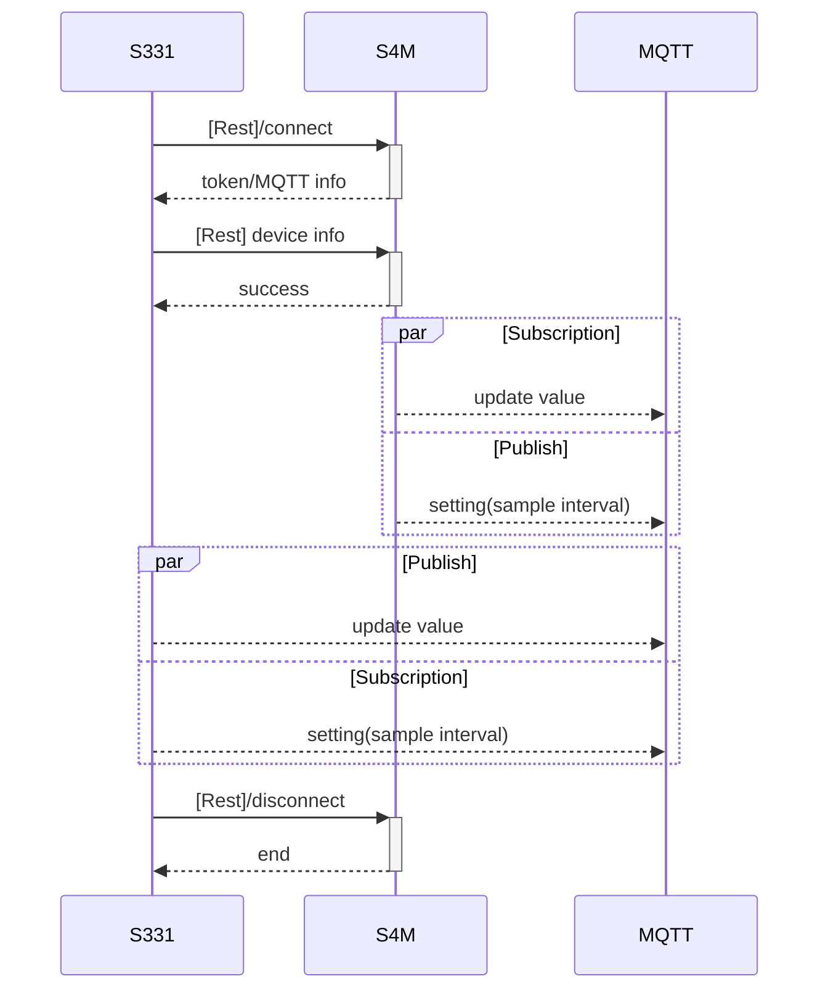

---
{"dg-publish":true,"permalink":"/work/s4-m-i-iot-sequence-diagram/"}
---

# S4M iIOT sequence diagram

```mermaid
sequenceDiagram
    S331->>+S4M: [Rest]/connect    
    S4M-->>-S331: token/MQTT info
    S331->>+S4M: [Rest] device info
    S4M-->>-S331: success
    par Subscription
    S4M-->>MQTT: update value
    and Publish
    S4M-->>MQTT: setting(sample interval)
    end
    par Publish
    S331-->>MQTT: update value    
    and Subscription
    S331-->>MQTT: setting(sample interval)
    end
    S331->>+S4M: [Rest]/disconnect    
    S4M-->>-S331: end	
```